1. **热身**。使用该类动作的前几式用于热身。做两组，第一组20，第二组15。
2. **慢工出细活**。做动作要慢，使用肌肉控制动作；不要急于进阶，将一级动作练到完美再升级。
3. **留有余力**。不要做到力竭，要留有一点余力，保证动作完整不变形。

# 俯卧撑

## 要点

1. 避免诡异的角度和手部姿势。找到适合自己的锻炼姿势。
2. 躯干、髋部、双腿始终要成一条直线。只有那些腰部力量太弱无法锁定躯干的人，才会出现做俯卧撑时撅屁股的情况。
3. 双腿始终要并拢。如果双腿分开，做动作时就无需保持躯干稳定，练习就变容易了。
4. 在动作最高点时，双臂要伸直，但不要让肘部完全锁定，而要使其微弯，以免关节不舒服。（有时这被描述为让手臂保持“柔软”。）
5. 要平缓地呼吸。根据我的经验：上推时应呼气，下降时应吸气。但如果你感觉呼吸费力，就不要遵循这一原则，而要多呼吸几次。

## 第一式：墙壁俯卧撑

**动作：**
面对墙壁站立，双脚并拢，双臂伸直，与肩同宽，双手平放在墙上，手掌与胸等高。这是该动作的起始姿势。弯曲肘部，直到前额轻触墙面。这是该动作的结束姿势。

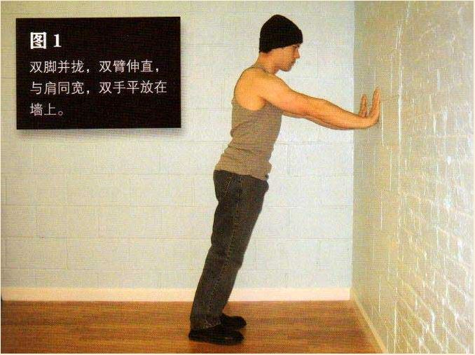

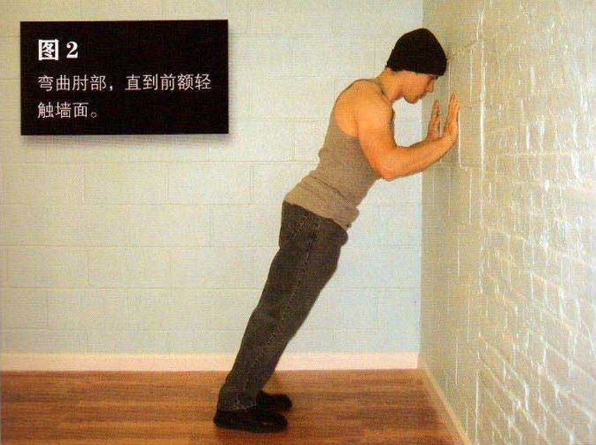

**目标**

|初级|中级|高级|
|-|-|-|
|1X10|2X25|3X50|

## 第二式：上斜俯卧撑

**动作：**
做这个动作需要借助一个稳固的物体，高度大约是你身高的一半（大概到臀部位置）。
双脚并拢，身体成一条直线，然后前倾上身，双臂伸直，双手抓住所选物体，与肩同宽。这是该动作的起始姿势。
弯曲肘部，放低身体，直到胸部轻触物体顶部。如果你选择的物体高度合适，那么此时你的身体与地面的夹角约为45°。暂停一会，然后将自己推回到起始姿势，如此重复。

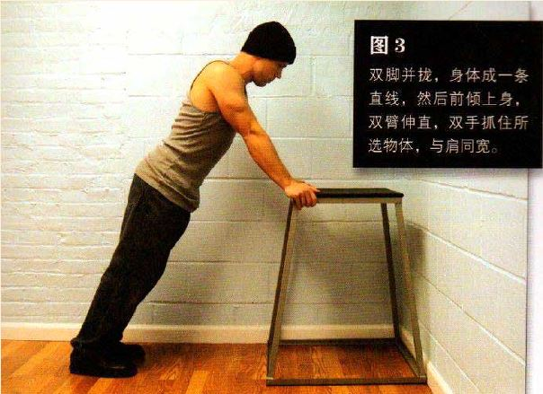

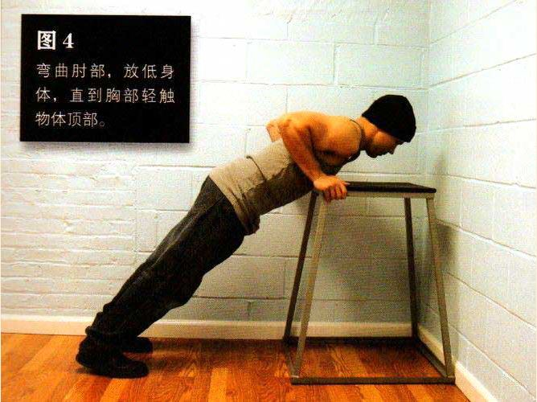

**目标**

|初级|中级|高级|
|-|-|-|
|1X10|2X20|3X40|

## 第三式：膝盖俯卧撑

**动作：**
双脚并拢，双膝着地。双臂伸直，与肩同宽。双手在胸部的正下方，两个手掌平放在地面上。脚踝搭在一起，大腿与上身及头部成一条直线，不要撅屁股或者塌腰。这是该动作的起始姿势（图5）。然后以膝盖为支点，弯曲肘部，直到胸部与地面仅一拳之隔（图6）。暂停一下，然后将自己推回到起始姿势，如此重复。

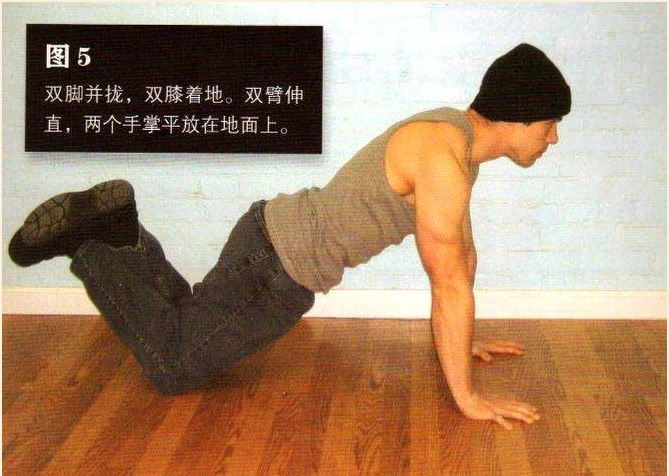

**目标**

|初级|中级|高级|
|-|-|-|
|1X10|2X15|3X30|

## 第四式：半俯卧撑

**动作：**
跪在地板上，双手撑地，双腿向后蹬直。双手与肩同宽，并处于上胸部的正下方。双腿双脚并拢，锁紧身体，使上身、髋部和双腿成一条直线。先伸直手臂，然后降低身体到大约一半臂长的高度，或者直到肘部弯成直角。控制下降高度的绝佳方式就是使用篮球或橄榄球——将球放在髋部下方。这是该动作的起始姿势（图7）。接下来，弯曲肘部，直到髋部与球轻轻接触（图8）。对大多数人来说，这样可以方便且客观地标示这个动作的最低点。暂停一下，然后用力将自己推回到起始姿势。

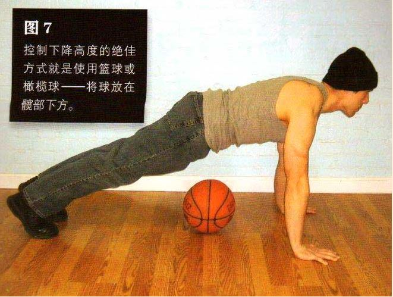

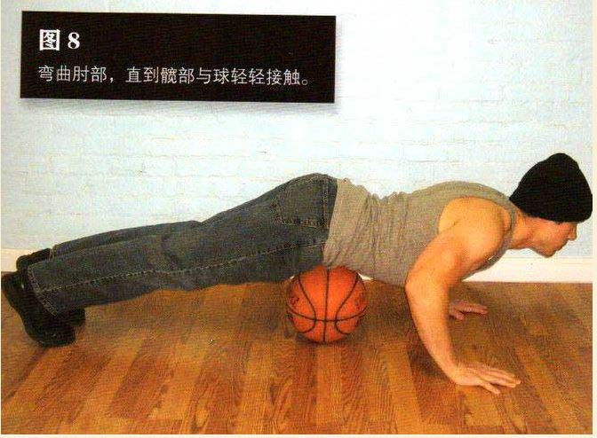

**目标**

|初级|中级|高级|
|-|-|-|
|1X8|2X15|3X25|

## 第五式：标准俯卧撑

**动作：**
跪在地板上，双手撑地，双腿向后蹬直。双腿双脚并拢，双手与肩同宽，并处于上胸部的正下方。双臂伸直，臀部与脊椎成一条直线。这是该动作的起始姿势（图9）。接着，弯曲肘部，直至胸部与地面仅一拳之隔。监狱里进行俯卧撑比赛时，计数者会握拳，让小拇指一侧紧贴地面，这样只需数参赛者胸部接触自己大拇指的次数即可。若你是单独锻炼，又想控制动作幅度，并想让身体与地面保持正确距离，可以在胸部正下方放一个棒球或网球（图10）。你在做动作的过程中，待胸部碰到球后暂停一下，然后回到起始姿势。

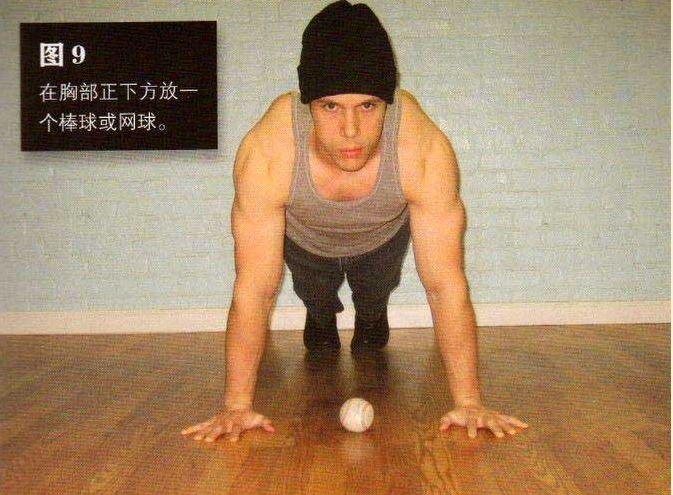

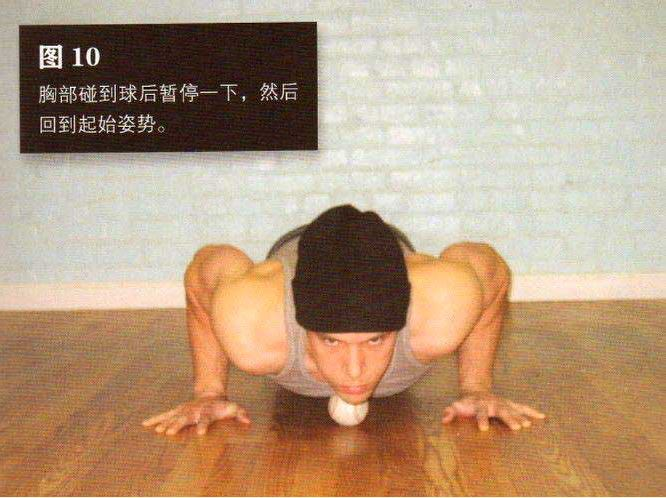

**目标**

|初级|中级|高级|
|-|-|-|
|1X5|2X10|3X20|

# 深蹲

## 要点
1. 动作进行到最低点时，大腿后侧会紧贴小腿，你的身体将**无法继续降低**。这时，需要大腿和膝盖共同发力才能将身体推起，直到双腿**完全伸直**。
2. 在动作的反向过程中，不要直接就那样蹲下了，而要用肌肉力量有控制地下蹲。
3. 在蹲过程中身体要前倾，但不要过分前倾。因为这样将过分锻炼髋部，而忽略了大腿。前倾是必要的，但不要养成向前弓背的习惯。
4. 最低点的姿势是深蹲中最难控制的部分——几乎所有练习都是如此，不过深蹲尤甚。尽管难度很高——做单腿深蹲时尤其难，但你在深蹲中绝不能快速下蹲，然后直接“反弹”（靠惯性）站起，这会严重损伤膝关节处的软骨。你应该通过前几式的练习慢慢增强肌腱的力量。
5. 起身前不要摇晃。
6. 不要踮起脚跟。

## 第一式：肩倒立深蹲

**动作：**

平躺，双膝弯曲，双手下压。双脚蹬离地面，直到举到空中。在将双腿举起的过程中，顺势把双手撑在下背部，注意上臂要紧贴地面。你现在摆出的姿势是肩倒立——靠双肩、上背部以及上臂支撑身体。要记住，始终用这几个部位支撑身体，不要让颈部受到压力。身体要锁定伸直，髋部不要弯曲。这是该动作的起始姿势（图21）。上半身要尽可能伸直，弯曲髋部与膝关节，直到膝盖轻触前额，这是该动作的结束姿势（图22）。然后伸直双腿，直到身体回到起始姿势，如此重复。

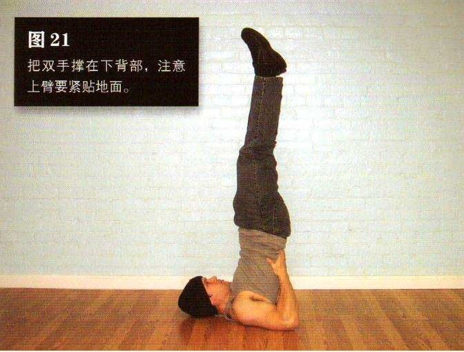

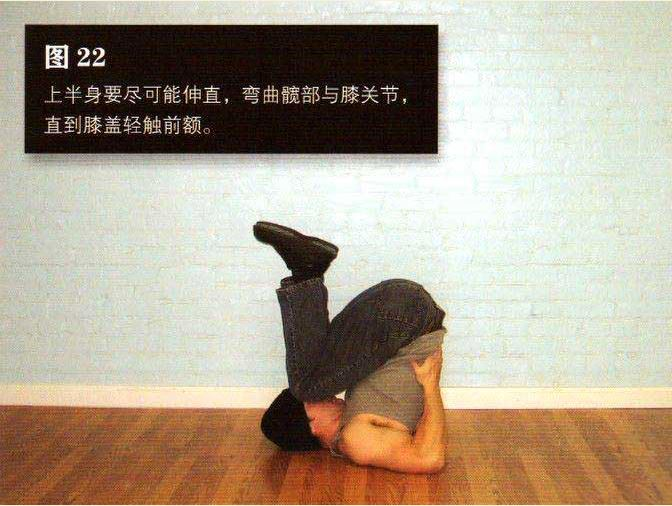

**目标**

|初级|中级|高级|
|-|-|-|
|1X10|2X25|3X50|

## 第二式：折刀式深蹲

**动作：**

站在一个稳固的物体前，此物体的高度大约与你的膝盖等高，至少也要达到胫骨上部，小咖啡桌、椅子、床铺都是不错的选择。双腿分开，与肩同宽或略宽。双腿伸直，弯腰俯身，直到双手与面前的物体接触。身体前倾，使一部分体重落在双手上。这是该动作的起始姿势（图23）。上半身尽量与地面平行，弯曲膝关节和髋部，直到大腿后侧紧贴小腿，无法蹲得更低为止。这是该动作的最低点（图24）。下蹲过程中你还需要弯曲双臂，在下降到最低点后腿部与手臂要同时发力，将身体推回到起始姿势。在整个动作过程中，脚跟始终不能抬离地面。

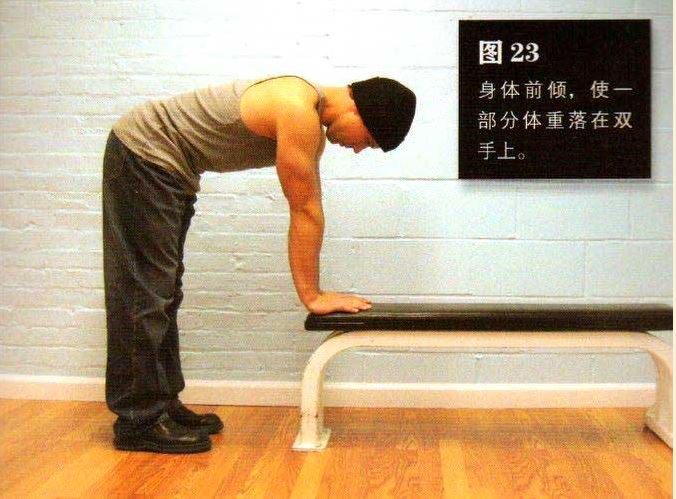

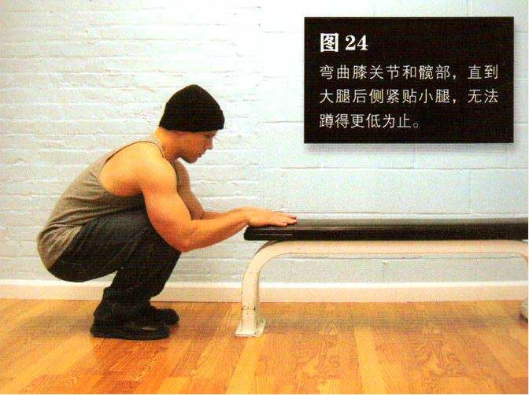

**目标**

|初级|中级|高级|
|-|-|-|
|1X10|2X20|3X40|

## 第三式：支撑深蹲

**动作：**

直立，双脚分开，与肩同宽或略宽。手臂向斜下方伸出，双手放在比自己的大腿略高的稳固物体上，书桌、高脚凳或椅背都可以。这是该动作的起始姿势（图25）。弯曲髋部与膝关节，身体慢慢下降，背部尽可能保持挺直，直到大腿后侧紧贴小腿，无法蹲得更低为止，这是该动作的最低点（图26）。暂停一会，然后主要靠腿部发力站起来。为了分担双腿的一部分压力，尤其是在最低点时，你要通过向下按压面前的物体，来借用手臂的一部分力量。

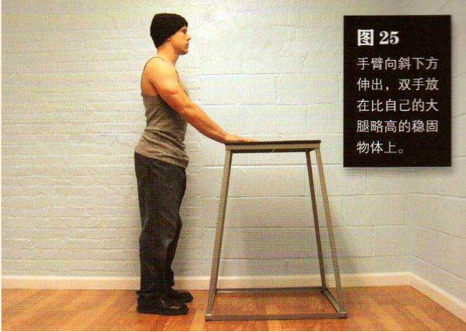

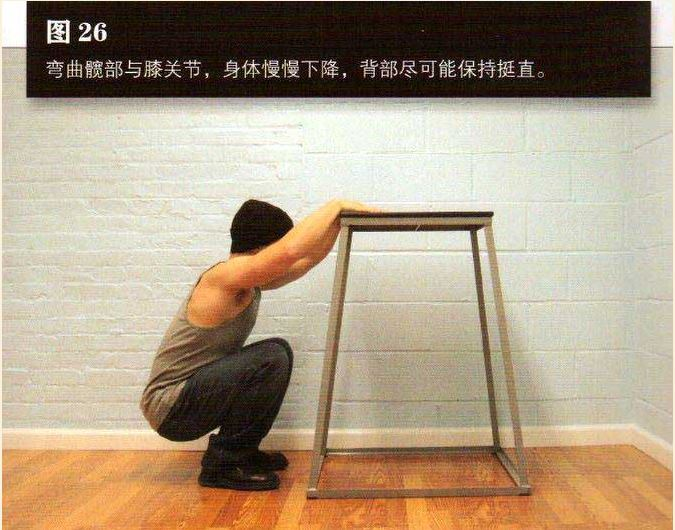

**目标**

|初级|中级|高级|
|-|-|-|
|1X10|2X15|3X30|

## 第四式： 半深蹲

**动作：**

站立，双脚分开，与肩同宽或略宽。脚尖不要正对前方，而要略微向外。双手放在髋部、胸部、肩部都可以——以舒适为前提。这是该动作的起始姿势（图27）。弯曲髋部和膝盖，直到膝关节弯曲成90°——换句话说就是大腿与地面平行。这是该动作的最低点（图28）。刚开始你可以借助一面镜子或是找朋友帮忙，直到能够自如地控制动作幅度。不要求快，也不要借助惯性起身，而要完全在肌肉控制下做整个动作。在最低点（半空中）坚持1秒钟，然后再回到起始姿势。在整个动作过程中，背部始终要挺直，双脚脚跟始终不能抬离地面。膝盖与脚尖应该始终朝向同一方向，深蹲时膝盖绝不要向内转，脚尖指向外有助于你做到这一点。

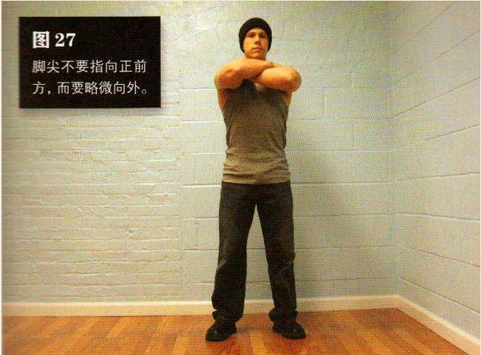

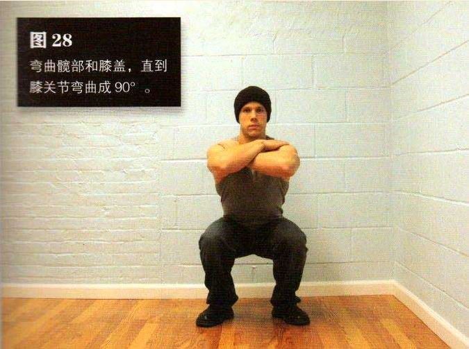

**目标**

|初级|中级|高级|
|-|-|-|
|1X8|2X35|3X50|

## 第五式： 标准深蹲

**动作：**

直立，双脚分开，与肩同宽或略宽（取决于个人偏好）。双脚略微向外转，双臂随意摆放，只要舒服即可。这是该动作的起始姿势（图29）。髋部与膝关节弯曲，背部始终挺直。 当大腿达到几乎与地面平行时，把你的身体重心向后转移，就像要坐下一样。有控制地继续放低身体，直到大腿后侧紧贴小腿。这是该动作的最低点（图30）。暂停一会，然后仅靠腿部发力将自己推回到起始姿势。起身过程和下蹲过程应该是完全相反的。脚跟始终不要抬离地面，膝盖也不能向内转。

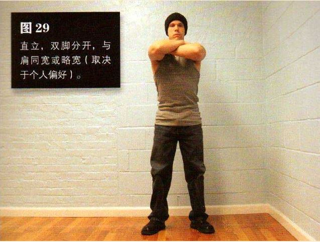

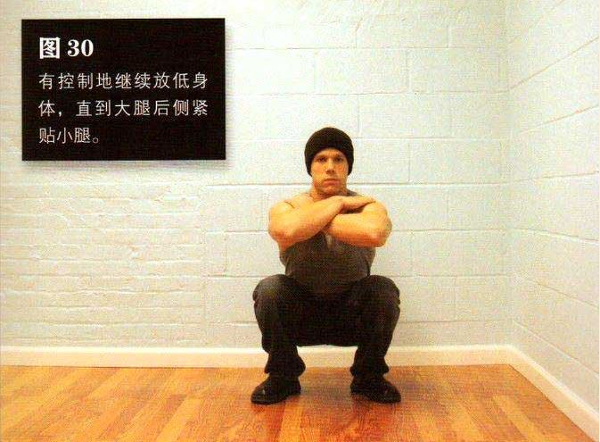

**目标**

|初级|中级|高级|
|-|-|-|
|1X5|2X10|3X30|

# 引体向上

## 要点
1. 做引体向上以下巴超过横杆为最佳。
2. 在起始姿势中，肘部要微微弯曲。
3. 为了稳住上身，肩部也要保持“收紧”的状态。
4. 抓握姿势有正握（指根关节朝向自己）、反握（指尖朝向自己）、侧握（拇指朝向自己),选择最舒服的姿势即可。最好使用吊环。
5. 千万不要蹬腿。应当借助肌肉的力量完成动作而非惯性。（蹬腿可以作为过渡过程中增加动作次数的辅助练习）

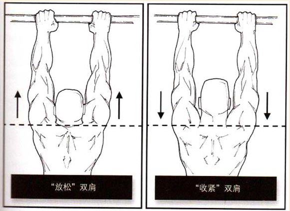

## 第一式：垂直引体

**动作：**
找一个可抓握且很稳固的竖直物体。靠近物体站立，脚尖与之保持约8-15厘米的距离。以舒服的姿势抓住该物体，理想情况是双手与肩同宽，但不必要——只要双手对称即可。这是该动作的起始姿势（图41）。由于你距离物体很近，所以手臂会弯曲。身体慢慢向后倾，在此过程中伸展手臂，直到手臂几乎伸直、身体后倾与地面成一定角度为止。这是该动作的结束姿势（图42）。此时，你的上背部应该有拉伸感，手臂可能也会有同感。暂停一会，再并拢肩脚骨并弯曲手臂，把身体拉回到起始姿势。暂停，然后再重复该动作。

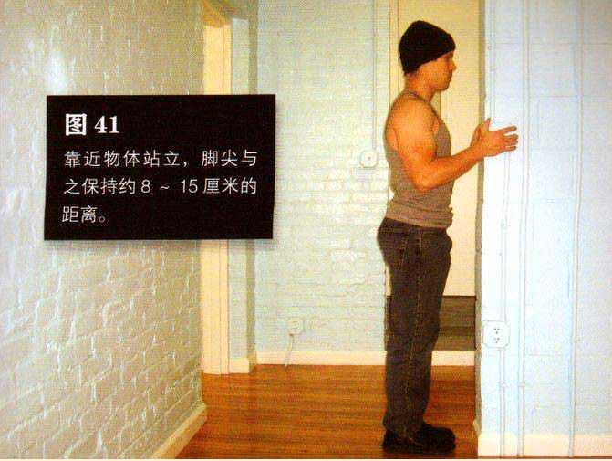

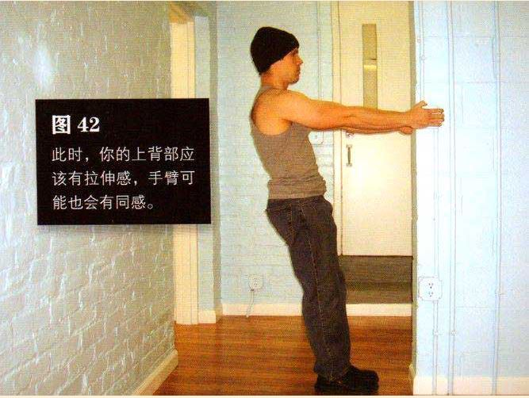

**目标**

|初级|中级|高级|
|-|-|-|
|1X10|2X20|3X40|

## 第二式：水平引体

**动作：**
找一个至少与你的髋部等高、稳固且双手可抓握的水平物体。该物体要能安全地承载你的体重，又大又结实的桌子（如餐桌和书桌）通常是最佳之选。钻到桌子下面——胸部与下肢都位于桌子下面，抬手抓住桌子边缘（使用正握姿势）。理想情况是，双手与肩同宽，但这要取决于你用的是什么样的桌子。然后拉起身体，使背部离地，只有脚跟与地面接触。有时你的手臂可能需要适当弯曲才能使背部离地——这取决于桌子的高度。身体绷紧，让双手和双脚脚跟承担身体的重量。这是该动作的起始姿势（图43）。然后平缓地拉起身体，在此过程中整个身体（尤其是膝盖）要成一条直线，直到胸部触到桌子边缘。这是该动作的结束姿势（图44）。暂停一下，然后降低身体，回到起始姿势，如此重复。

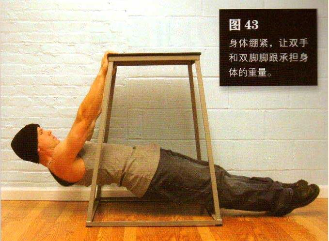

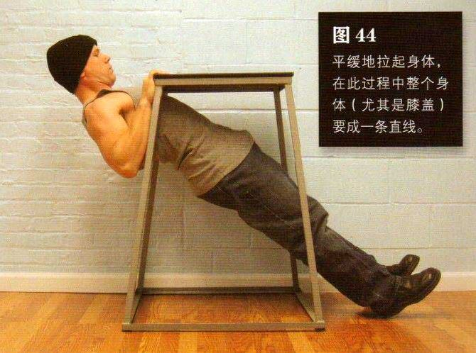

**目标**

|初级|中级|高级|
|-|-|-|
|1X10|2X20|3X30|

## 第三式：折刀引体向上

**动作：**
练习折刀引体向上需要高一点的横杆，横杆下面放一把高脚凳或类似物体。向上跳起抓住横杆，手臂大约与肩同宽，采取正握姿势。用横杆训练时，肩部始终要收紧，手臂也不能完全放松，肘部微微弯曲。将双腿向上摆，把双脚脚跟搭在横杆前方的高脚凳上，双腿要完全伸直。该物体要足够高，理想情况是双腿伸直时脚踝与骨盆恰好在同一高度，此即经典的折刀角度。这是该动作的起始姿势（图45）。然后平缓地把身体拉起，伸直的双腿向下压以帮助完成动作，最后使下巴高过横杆。这是该动作的结束姿势（图46）。

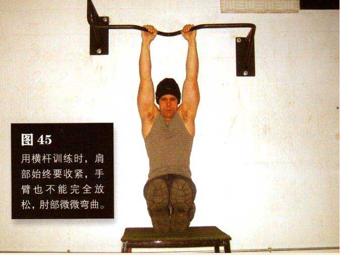

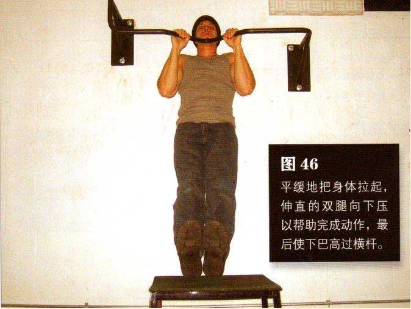

**目标**

|初级|中级|高级|
|-|-|-|
|1X10|2X15|3X20|

## 第四式：半引体向上

**动作：**
选择足够高的横杆，使得身体悬垂在上面时双脚依然离地，即便只离地一厘米也可以。 向上跳起抓住横杆，采用正握姿势，两手与肩同宽或略宽，双臂弯曲接近90°上臂应与地面平行），肩部始终收紧。膝部微屈，脚躁交叠在一起，以免双腿辅助借力。这是该动作的起始姿势（图47）。弯曲肘部，夹起肩部，平缓地拉起身体，直到下巴超过横杆。这是该动作的结束姿势（图48）。在最高处暂停一下，然后有控制地下降到起始姿势。在动作过程中肘部可以向前移动，但两腿应始终保持不动。

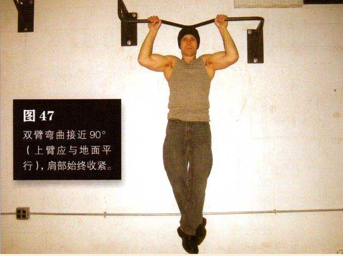

**目标**

|初级|中级|高级|
|-|-|-|
|1X8|2X11|3X15|

## 第五式：标准引体向上

**动作：**
以正握姿势握住横杆，双手与肩同宽或略宽——你可以试试看多大宽度对你来说最容易发力。双脚离地，双膝微屈，脚踝交叠在一起并置于身后。身体绷紧，双肩收紧，肘部略微弯曲（几乎看不出来），让肌肉而不是肘关节承担压力。这是该动作的起始姿势（图49）。
弯曲肘部，夹起肩部，直至下巴超过横杆。这是该动作的结束姿势（图50）。欣赏一下上面的风景吧！暂停一会，然后有控制地反向运动。不要做爆发式动作，否则惯性就会参与进来。

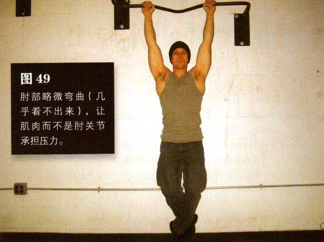

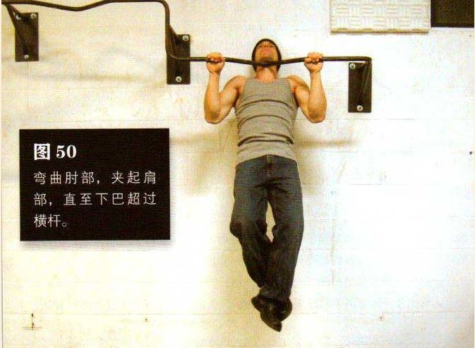

**目标**

|初级|中级|高级|
|-|-|-|
|1X5|2X8|3X10|

# 举腿

## 要点

1. 呼吸会收紧腹部肌肉和肋间肌。为了最大化这种效果，在放下双腿时吸气，在动作进行到最高点呼气完毕。若有必要，可以在两次动作之间喘几口气。
2. 腹横肌是腰部深处的肌肉层，其作用就像紧身胸衣一样，能够把内脏固定在特定位置。 腹横肌如果很弱，在压力之下就可能被撕裂，使一些内脏向外凸出，形成疝气。在腹肌练习中，应该通过紧紧收缩腹部来锻炼腹横肌。在日常生活中始终通过收腹保持好姿势也会有锻炼效果。
3. 做腹部练习之前，要确定胃里的食物已经消化得差不多了。吃饭与练习腹肌的时间间隔至少为两小时，否则会出现腹胀，从而影响动作。
4. 如果你发现直腿举腿很难，这可能是由于你的胸绳肌过紧所致。训练前先拉伸腘绳肌，情况会好一些。
5. 在举腿练习的最低点，如果用一点儿惯性摆动身体，动作就会变得容易不少，千万不要这样做。如果你的举腿动作没法干净利落，那就回到上一式，直到你足够强再以正确的动作练习下一式。

## 第一式： 坐姿曲腿

**动作：**

坐在椅子或床的边缘，身体略微向后倾斜，双手抓住边沿，两腿伸直，双脚并拢，脚跟距离地面几厘米。这是该动作的起始姿势（图61）。平缓地抬起膝盖，直到膝盖距胸部约15—25厘米。在此过程中呼气，动作完成时呼气结束，腹肌保持收缩状态。这是该动作的结束姿势（图62）。暂停1秒钟，进行反向运动并回到起始姿势。伸展膝盖的同时吸气。双脚应该始终沿着一条直线移动，而且始终保持悬空，直到一组动作完成方可接触地面。腹部要始终收缩，动作要慢，要抵制快速完成动作的冲动。如果需要，可以在两次动作之间喘几口气（所有中段练习都一样）。

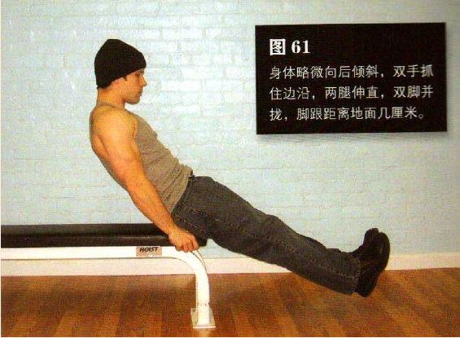

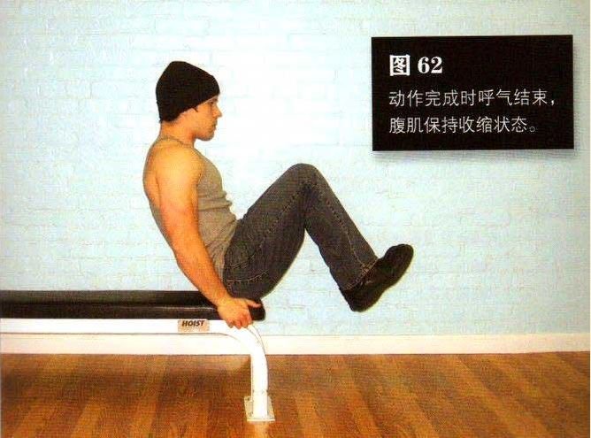

**目标**

|初级|中级|高级|
|-|-|-|
|1X10|2X25|3X40|

## 第二式： 平卧抬膝

**动作：**

平躺在地上，双腿并拢，双手置于身体两侧的地板上。膝盖弯曲近90°双脚距离地面约2—5厘米。双手用力向下按压地板，这样有助于保持身体稳定。这是该动作的起始姿势（图63）。然后平缓地抬起膝盖，越过髋部，直到大腿与地面垂直、小腿与地面平行，整个过程中膝盖始终接近90°。在此过程中呼气，腹部肌肉保持收紧。这是该动作的结束姿势（图64）。暂停1秒钟，进行反向动作。降低双脚，回到起始姿势，并在此过程中吸气。在整组练习中双脚都不能接触地面。

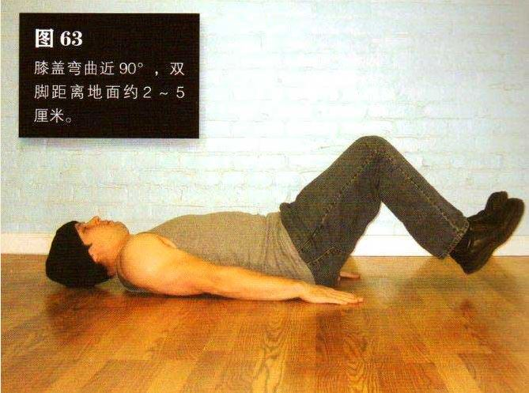

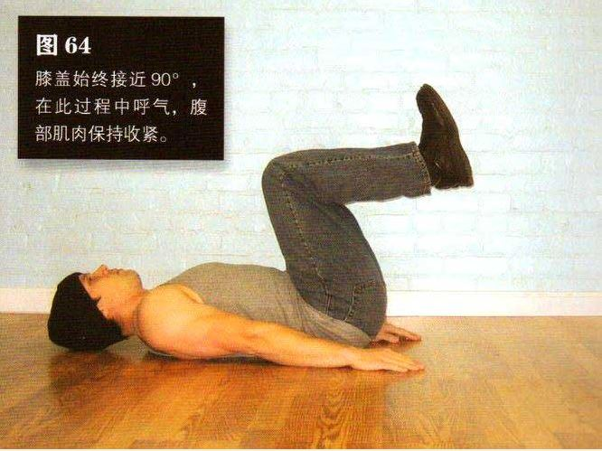

**目标**

|初级|中级|高级|
|-|-|-|
|1X10|2X20|3X35|

## 第三式： 平卧屈举腿

**动作：**
平躺在地上，双腿并拢伸展，双手置于身体两侧的地面上。双腿抬起，膝盖弯曲，使大腿与小腿的夹角大约成135°双脚距离地面约2—5厘米。这是该动作的起始姿势（图65）。 该练习前半部分的动作包括平缓地抬起双腿和双脚，持续大约2秒钟，直到双脚位于骨盆正上方（图66）。在整个动作过程中，膝盖弯曲的角度应该保持不变——始终“锁定”。双手向下按压地板，这样有助于保持身体稳定。两脚位于骨盆正上方时，略作停顿，然后进行反向动作。在回复到起始姿势时也略作停顿，然后重复以上过程。双脚向上运动时呼气，向下运动时吸气。在整组练习中，腹部始终都要收紧，双脚始终不能接触地面。

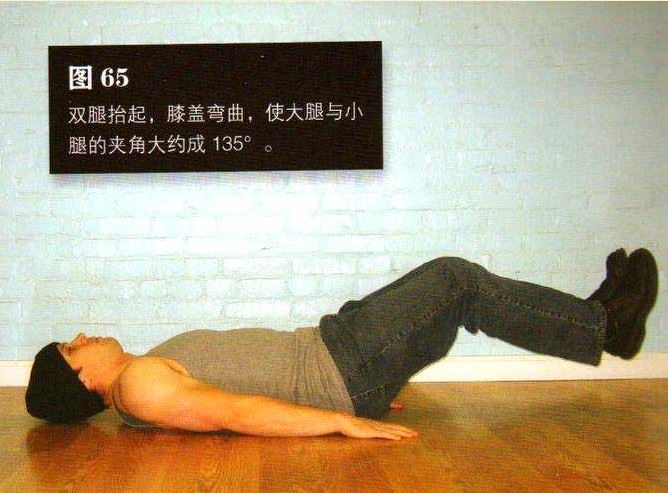

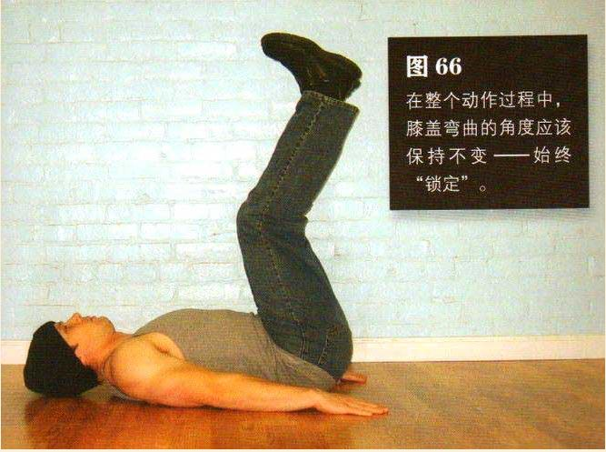

**目标**

|初级|中级|高级|
|-|-|-|
|1X10|2X15|3X30|

## 第四式： 平卧蛙举腿

**动作：**
先做第三式前半部分的屈举腿动作，但在最高点的时候（图66）不要停顿，而是要完全伸直双腿，使其与地面垂直，并与上半身的夹角成90°这是该动作的结束姿势（图67）。 应该在这个两部分的动作过程中呼气。大多数中段练习此时都要反向重复前半部分的动作，但这个练习有所不同。在有阻力（重力）的情况下降低双腿比抬起双腿要容易，蛙举腿正利用了这一点。降低双腿并保持完全伸展（图68），直到双腿距离地面约2-5厘米（图69）。
大多数练习动作中上与下的过程都要经过2秒钟，但该练习的下落过程要经过4秒钟，以便身体在有利的姿势中获得更多的锻炼。双腿慢慢下降时吸气，然后重复以上动作。

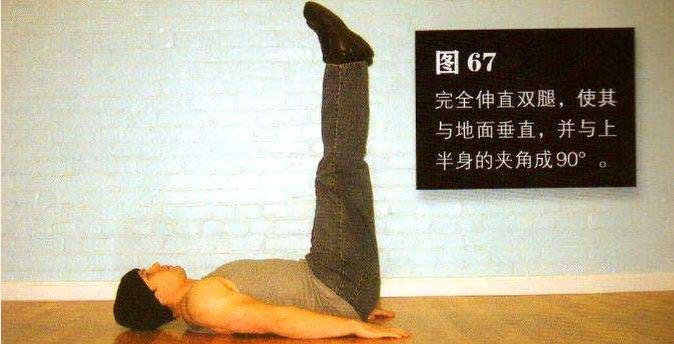

**目标**

|初级|中级|高级|
|-|-|-|
|1X8|2X15|3X25|

## 第四式： 平卧蛙举腿

**动作：**
先做第三式前半部分的屈举腿动作，但在最高点的时候（图66）不要停顿，而是要完全伸直双腿，使其与地面垂直，并与上半身的夹角成90°这是该动作的结束姿势（图67）。 应该在这个两部分的动作过程中呼气。大多数中段练习此时都要反向重复前半部分的动作，但这个练习有所不同。在有阻力（重力）的情况下降低双腿比抬起双腿要容易，蛙举腿正利用了这一点。降低双腿并保持完全伸展（图68），直到双腿距离地面约2-5厘米（图69）。
大多数练习动作中上与下的过程都要经过2秒钟，但该练习的下落过程要经过4秒钟，以便身体在有利的姿势中获得更多的锻炼。双腿慢慢下降时吸气，然后重复以上动作。

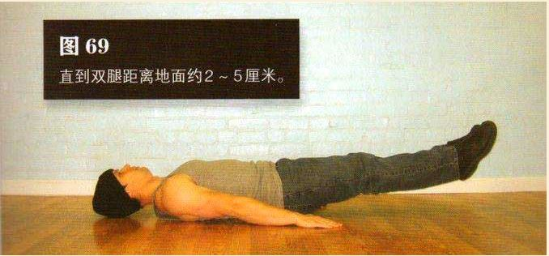

**目标**

|初级|中级|高级|
|-|-|-|
|1X8|2X15|3X25|

## 第五式： 平卧直举腿

**动作：**
平躺在地上，面部朝上。双脚并拢，双腿伸直，双手置于身体两侧。抬起双脚，使其距离地面约2-5厘米。双手向下按压地板，以保持身体稳定。这是该动作的起始姿势（图70）。 双腿锁定，抬起双脚直到它们到达骨盆正上方，即双腿与上半身的夹角成90°这是该动作的结束姿势（图71）。抬脚的过程中呼气，腹部保持收紧。至少要用2秒钟平缓地完成该动作，不要用猛劲。停顿片刻，然后反向动作，降低双腿的过程中吸气。到达起始姿势后略作停顿，再重复。在整个动作过程中，膝盖始终要锁定，双脚不能接触地面，直到一组完成之后方可。

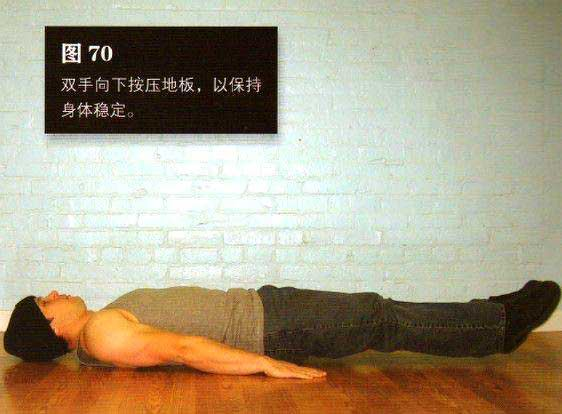

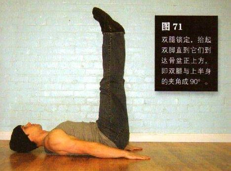

**目标**

|初级|中级|高级|
|-|-|-|
|1X5|2X10|3X20|

# 桥

## 要点

1. 脊柱应该形成凹面，背部必须形成优美的弧形。说来简单，但如果脊柱的深层肌肉很弱，那么训练者就倾向于使用四肢撑起身体，这样背部会显得很直挺。
2. 背部应该远离地面。孱弱的桥最明显标志就是髋部只能勉强离地；完美的桥，髋部与臀部应该比头部和肩脚骨要高。这点很难判断，除非你从侧面给自己拍一张照片。
3. 双臂与双腿应该伸直。做桥时，双臂伸直相对容易，但要双腿与其同时伸直，则需要训练者具有非常好的柔韧性。
4. 呼吸应该又深又平缓。桥使胸腔伸展，使肺部受到压力，如果胸部僵硬，那训练者的呼吸会急促不平。自然的呼吸是掌握桥的标志。切记，练习时绝不要屏住呼吸。

## 第一式：短桥

**动作：**
躺在地上，双手叠放在腹部。膝盖弯曲，将双脚拉向臀部，直到胫骨与地面接近垂直，此时脚跟距离臀部约 15~20 厘米，脚掌平放在地上。双脚与肩同宽或略窄，依个人舒适度而定。这是起始姿势（图83）。然后双脚用力下压，身体向上拱起，使髋部和背部离开地面，直到仅以双肩和双脚支撑整个身体。此时，大腿和躯干应成一条直线，髋部不要下沉。这是结束姿势（图84）。暂停一会，然后做反向动作，缓缓地放低身体，直到回到起始姿势，如此重复。身体撑起时呼气身体放低时吸气。

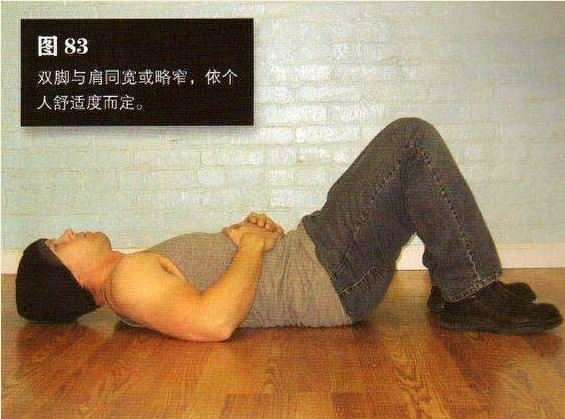

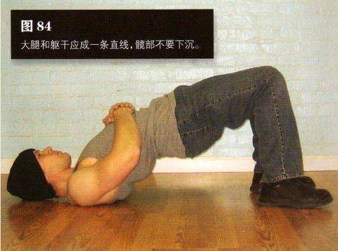

**目标**

|初级|中级|高级|
|-|-|-|
|1X10|2X25|3X50|

## 第二式：直桥

**动作：**
坐在地上，双腿伸直，双脚与肩同宽。手掌平放在髋部两侧的地上，手指朝前。坐直，此时腿和上半身之间的夹角成90°，这是该动作的起始姿势（图85）。双手用力下压，双臂绷紧，同时将髋部向上推起，直到双腿与躯干成一条直线。下巴向上抬起，看向天花板，此时只用手掌和脚跟支撑身体。这是结束姿势（图86）。暂停一会，然后反向运动。身体撑起时呼气，身体放低时吸气。

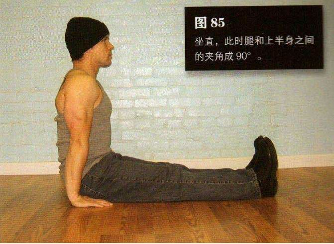

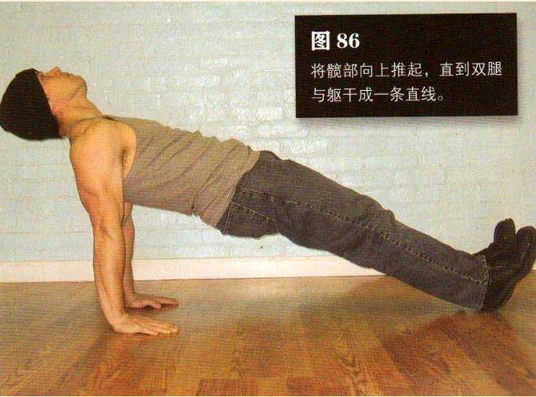

**目标**

|初级|中级|高级|
|-|-|-|
|1X10|2X20|3X40|

## 第三式：高低桥

**动作：**
高低桥需要借助一个与膝盖等高或略高的物体，在监狱里，床铺是最好的选择。一般家庭里的床稍高一点，但也可以。坐在床的边缘，身体向后躺在床上，双脚平放地上，与肩同宽。身体往前挪，以便髋部离开床。双手放在头部两侧，手指指向脚。这是该动作的起始姿势（图87）。双手用力下压，肘部打开，推起髋部，同时背部弯起成弧形。继续平缓地尽力上推身体，至少让头部与身体完全离开床。手臂不必完全伸直，肘部应该是弯曲的。或许你只能将自己的身体推起几厘米，那就可以了。有控制地向后仰头，以便能看见身后的墙壁。

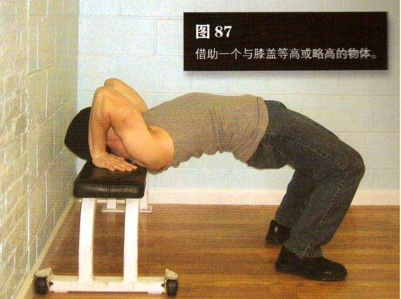

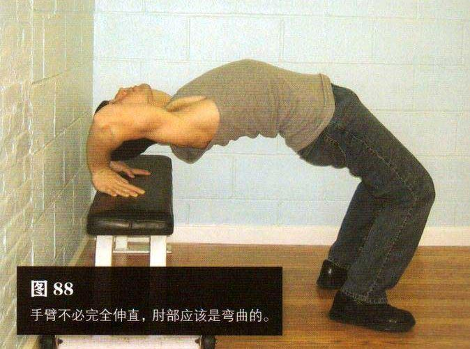

**目标**

|初级|中级|高级|
|-|-|-|
|1X8|2X15|3X30|

## 第四式：顶桥

**动作：**
平躺在地上，弯曲膝盖，把脚拉向臀部，直到脚跟与臀部相距约15-20厘米。双脚与肩同宽或略窄，双手撑在头部两侧的地板上，手指指向脚，两肘指向天花板。尽力抬起髋部，使身体离地。手臂与腿继续用力推，直到背部形成优美的弧形，髋部高高抬起。头向下仰，头顶指向地板，这是“桥式”。保持这个姿势一会儿，然后弯曲手臂与双腿，直到头部轻轻接触地板。这是该动作的起始姿势（图89）。再次暂停一会，然后将背部向上推起成“桥式”。
这是该动作的结束姿势（图90）。运动过程中要小心，以免撞到头部。在整个练习组中，背部始终要保持弧形，并且尽量正常呼吸。完成训练目标之后，慢慢地放低肩部、背部和髋部，直至整个身体接触地面。

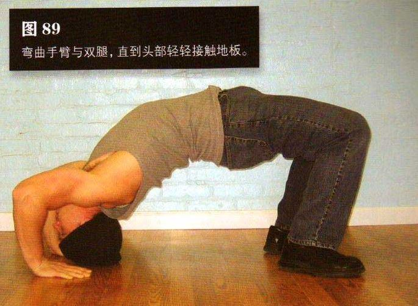

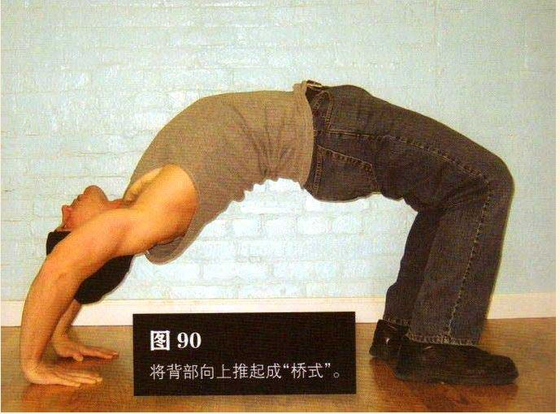

**目标**

|初级|中级|高级|
|-|-|-|
|1X8|2X15|3X25|

## 第五式：半桥

**动作：**
这个动作需要借助一个篮球或足球来控制动作幅度。坐在地上，把球放在自己身后的地上（靠近自己）。向后躺，只有双肩和双脚在地面上，双脚与肩同宽或略窄，球支撑着腰部。 如果你感觉这种姿势不舒服，在开始前可以在球上放上毛巾或坐垫。双手撑在头部两侧的地板上，手指指向脚。然后，用手把双肩和头部推离地板，只用双脚、球和手掌支撑身体。这是该动作的起始姿势（图91）。在这个姿势基础上髋部要尽力向上顶起，伸展手臂和双腿，抬起背部，直到背部完全离开球。继续向上运动，直到背部形成完全的弧形。这是结束姿势（图92）。在最高处暂停一会，然后慢慢放低身体，回到起始姿势。在一组动作过程中，后腰只能轻轻接触球，而不能将整个身体的重量都压在球上。重复练习，尽量保持正常呼吸。

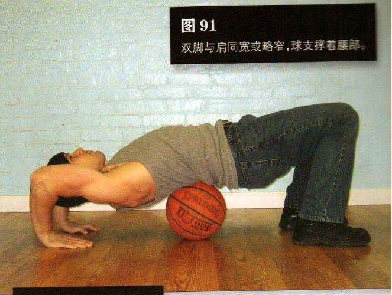

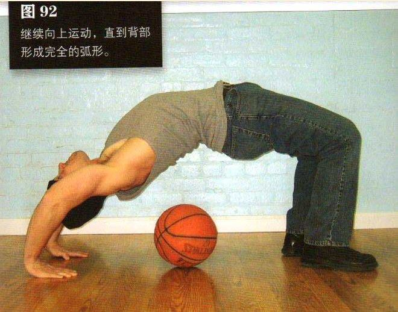

**目标**

|初级|中级|高级|
|-|-|-|
|1X8|2X15|3X20|

# 倒立撑

## 要点

1. 蹬起时双手不要离墙太近——约15—25厘米（有时更远）会更稳定。双手与肩同宽，重量训练者也许倾向于更宽一些，但那样会不太稳定，并使动作缺乏效率。
2. 练习倒立撑时，不要像做推举那样强迫两肘分开。肘部会自然向内，或者正对着胸前，或者略微斜向外。哪种都可以，舒服即可。
3. 身体不要完全伸直，要略微向前弯曲。双脚比头部更靠后（见图112），这是身体倒立时最自然的平衡方式。背部既不要过度弯曲，也不要完全伸展，保持一定的弧度。
4. 刚开始练习时，你可能想把背部抵在墙上，以分担体重，这可不是好习惯。你最终要达到的是只有双脚脚跟接触墙壁的水平。遵循上面的技巧要点——双手与墙壁有一定距离，身体弯成一定的弧度——双脚脚跟自然而然就会成为身体与墙壁的唯一接触点。你无需强迫自己摆任何怪异的姿势。
5. 初学者先掌握窄距俯卧撑，即俯卧撑系列的第六式（参见第五章），然后再尝试倒立撑系列的第一式，

## 第一式：靠墙顶立

**动作：**
找一堵墙，在墙根处放置一个枕头（坐垫或叠好的毛巾也可）。双手和双膝着地，将头顶在枕头上，头部距离墙壁约15—25厘米。双手稳稳地放在头部两侧，大约与肩同宽。抬起一条腿的膝盖，让其靠近同侧的肘部，同时伸直另一条腿，使膝盖离地（图107）。然后，让靠近肘部的腿使劲蹬地，同时将另一条腿向上踢，从而让两条腿同时靠向墙壁。一旦双脚靠在墙壁上，就慢慢伸直双腿，把身体摆正（图108）。嘴巴保持闭合，用鼻子平缓呼吸。 坚持所需时间后，弯曲双腿，并有控制地放下它们。

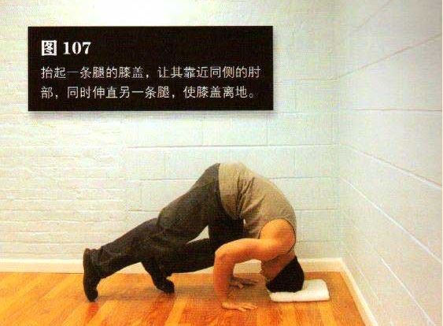

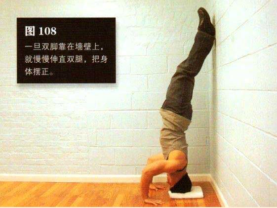

**目标**

|初级|中级|高级|
|-|-|-|
|30s|1min|2min|

## 第二式：乌鸦式

**动作：**
双膝分开，呈蹲坐姿势。双手手掌放在身体前面的地板上，与肩同宽。双臂略微弯曲，身体向前倾斜，然后让双膝稳稳地夹在两肘外侧（图109）。身体继续前倾，一点一点把体重转移到手掌上，双脚的负重则越来越少。最终重心前移，双脚离地。双脚用力提起，保持平衡，平缓呼吸，坚持一定的时间（图110）。然后反向运动，身体重心慢慢后倾，直到脚尖再次接触地面。

**目标**

|初级|中级|高级|
|-|-|-|
|10s|30s|1min|

## 第三式：靠墙倒立

**动作：**
找一面墙，双手手掌平放在距离墙根约15-25厘米的地面上，双手与肩同宽。手臂伸直或近乎伸直，膝盖弯曲，撑起身体。提起一条腿的膝盖，让其靠近同侧的肘部（图111），然后使劲向下蹬地，同时让另一条腿向后上方摆。与此同时，让蹬地的腿也离地，紧随另一条腿向墙壁靠近，手臂保持伸展，双脚脚跟应同时接触墙壁。刚开始练习时，上踢的力量如果过大，你的后背和屁股会猛地撞到墙上，但久而久之你就会掌握完美的上墙技艺。最后，你的手臂应该是直的，身体摆正，背部略向内弓。这就是标准的靠墙倒立姿势（图112）。 保持这一姿势一段时间，整个过程中保持正常呼吸。

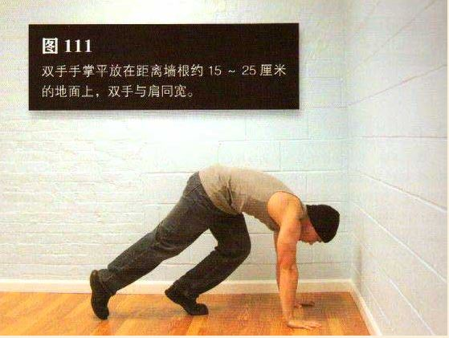

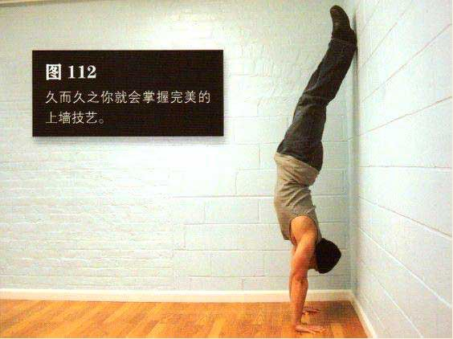

**目标**

|初级|中级|高级|
|-|-|-|
|30s|1min|2min|

## 第四式：半倒立撑

**动作：**
找一堵墙，双手手掌平放在距离墙根约15—25厘米的地面上，双手与肩同宽。手臂尽量伸直，蹬起成靠墙倒立姿势（第三式）。你现在应该处于标准的靠墙倒立姿势——手臂伸直，身体收紧，背部略微向内弓，脚跟与墙壁轻轻接触。这是该动作的起始姿势（图113）。 然后弯曲肘部，使头部向地面方向下降一半高度。这是该动作的结束姿势（图114）。暂停一下，然后稳稳地推起身体，回到起始姿势。整个动作的运动幅度大约只有15 厘米。刚开始练习时不要误判距离，让身体降得太低。整组练习中保持平缓呼吸。

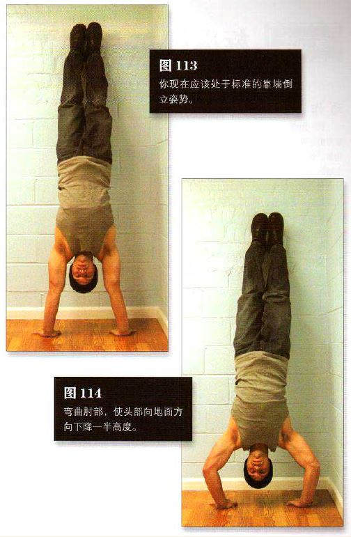

**目标**

|初级|中级|高级|
|-|-|-|
|1X5|2X10|3X20|

## 第五式：标准倒立撑

**动作：**
找一面墙，双手手掌平放在距离墙根约15—25厘米的地面上，双手与肩同宽。双膝曲，蹬起靠墙成倒立姿势。如果你从前几式一路练过来，那现在对此过程必然了如指掌。如果你已经找到了适合自己的上墙技巧，那也很好。重要的是培养肌肉，而不是上墙的方式。上墙之后，只有双脚脚跟与墙壁接触，背部略微向内弯曲成弓形，双臂伸直。这是该动作的起始姿势（图115）。弯曲肘部，直到头顶轻轻接触地板。这是该动作的结束姿势（图116）。使用“亲亲宝贝”的方法保护头部（参见第37页）。暂停1秒钟，然后推起身体，回到起始姿势。在所有倒立动作中都要通过肌肉控制身体，同时还要集中精神，以确保安全。尽量保持平缓呼吸。

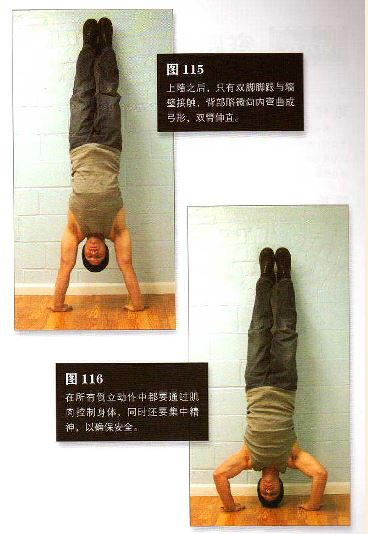

**目标**

|初级|中级|高级|
|-|-|-|
|1X5|2X10|3X15|
