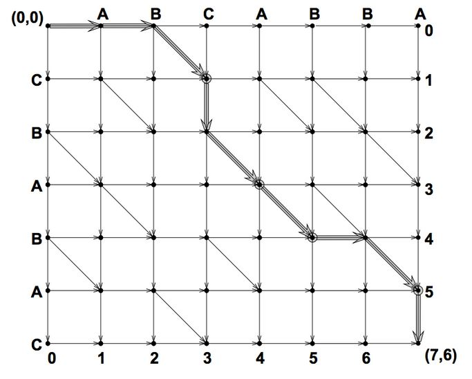

# 动态规划-从新手到专家

[英文原版](https://www.topcoder.com/community/data-science/data-science-tutorials/dynamic-programming-from-novice-to-advanced/)

[中文版](http://www.hawstein.com/posts/dp-novice-to-advanced.html)

[其他中文版](http://blog.csdn.net/doc_sgl/article/details/9026405)

# 动态规划

参考自:[liufeng_king的专栏](http://blog.csdn.net/liufeng_king/article/details/8490770)

动态规划：通过把原问题分解为相对简单的子问题的方式求解复杂问题的方法。动态规划常常适用于有重叠子问题和最优子结构性质的问题。     

基本思想：若要解一个给定问题，我们需要解其不同部分（即子问题），再合并子问题的解以得出原问题的解。 通常许多子问题非常相似，为此动态规划法试图仅仅解决每个子问题一次，从而减少计算量： 一旦某个给定子问题的解已经算出，则将其记忆化存储，以便下次需要同一个子问题解之时直接查表。 这种做法在重复子问题的数目关于输入的规模呈指数增长时特别有用。

与分治法区别：动态规划算法与分治法类似，都使用了将问题实例归纳为更小的、相似的子问题，并通过求解子问题产生一个全局最优值的思路，但动态规划不是分治法：关键在于分解出来的各个子问题的性质不同。分治法要求各个子问题是独立的(即不包含公共的子问题)，因此一旦递归地求出各个子问题的解后，便可自下而上地将子问题的解合并成原问题的解。如果各子问题是不独立的，那么分治法就要做许多不必要的工作，重复地解公共的子问题。动态规划与分治法的不同之处在于动态规划允许这些子问题不独立(即各子问题可包含公共的子问题)，它对每个子问题只解一次，并将结果保存起来，避免每次碰到时都要重复计算。   

相关术语：

(1)阶段：把所给求解问题的过程恰当地分成若干个相互联系的阶段，以便于求解，过程不同，阶段数就可能不
同，描述阶段的变量称为阶段变量。在多数情况下，阶段变量是离散的。此外，也有阶段变量是连续的情形。如果过程可以在任何时刻作出决策，且在任意两个不同的时刻之间允许有无穷多个决策时，阶段变量就是连续的。

(2)状态：状态表示每个阶段开始面临的自然状况或客观条件，也称为不可控因素。过程的状态通常可以用一个或一组数来描述,称为状态变量。一般状态是离散的,但有时为了方便也将状态取成连续的。

(3)无后效性：状态具有下面的性质,如果给定某一阶段的状态,则在这一阶段以后过程的发展不受这阶段以前各段状态的影响,所有各阶段都确定时,整个过程也就确定了。换句话说,过程的每一次实现可以用一个状态序列表示,在前面的例子中每阶段的状态是该线路的始点,确定了这些点的序列,整个线路也就完全确定。从某一阶段以后的线路开始,当这段的始点给定时,不受以前线路,所通过的点,的影响。状态的这个性质意味着过程的历史只能通过当前的状态去影响它的未来的发展,这个性质称为无后效性。

(4)决策：一个阶段的状态给定以后,从该状态演变到下一阶段某个状态的一种选择(行动)称为决策。在最优控制中,也称为控制。在许多间题中,决策可以自然而然地表示为一个数或一组数。不同的决策对应着不同的数值。描述决策的变量称决策变量,因状态满足无后效性,故在每个阶段选择决策时只需考虑当前的状态而无须考虑过程的历史。决策变量的范围称为允许决策集合。

(5)策略：由每个阶段的决策组成的序列称为策略。对于每一个实际的多阶段决策过程，可供选取的策略有一定的范围限制，这个范围称为允许策略集合。允许策略集合中达到最优效果的策略称为最优策略。

(6)最优性原理: 作为整个过程的最优策略,它满足,相对前面决策所形成的状态而言,余下的子策略必然构成―最优子策略。

问题特征：

(1)最优子结构：当问题的最优解包含了其子问题的最优解时，称该问题具有最优子结构性质。

(2)重叠子问题：在用递归算法自顶向下解问题时，每次产生的子问题并不总是新问题，有些子问题被反复计算多次。动态规划算法正是利用了这种子问题的重叠性质，对每一个子问题只解一次，而后将其解保存在一个表格中，在以后尽可能多地利用这些子问题的解。

算法步骤：

(1)分析最优值的结构，刻画其结构特征；

(2)递归地定义最优值；

(3)按自底向上或自顶向下记忆化的方式计算最优

# 一维DP

## 斐波那契数列

>斐波那契数列（Fibonacci sequence），又称黄金分割数列、因数学家列昂纳多·斐波那契（Leonardoda Fibonacci）以兔子繁殖为例子而引入，故又称为“兔子数列”，指的是这样一个数列：1、1、2、3、5、8、13、21、34、……在数学上，斐波纳契数列以如下被以递归的方法定义：F(0)=0，F(1)=1, F(n)=F(n-1)+F(n-2)（n>=2，n∈N*）

按照定义，可以很容易的写出其递归解：
```java
import java.util.Scanner;

public class FibonacciPolynomial {

	public static void main(String[] args) {
		Scanner reader =new Scanner(System.in);
		while(reader.hasNextInt()){
			int n=reader.nextInt();
			System.out.println(fib(n));
		}

	}
	/**
	 * 递归解
	 * @param n
	 */
	public static int fib(int n){

		if(n==0||n==1){
			return n;
		}
		return fib(n-1)+fib(n-2);
	}

}

```

以上代码在n=5时，fib(5)的计算过程如下:
```
fib(5)
fib(4) + fib(3)
(fib(3) + fib(2)) + (fib(2) + fib(1))
((fib(2) + fib(1)) + (fib(1) + fib(0))) + ((fib(1) + fib(0)) + fib(1))
(((fib(1) + fib(0)) + fib(1)) + (fib(1) + fib(0))) + ((fib(1) + fib(0)) + fib(1))
```
由上面可以看出，这种算法对于相似的子问题进行了重复的计算，因此不是一种高效的算法。实际上，该算法的运算时间是指数级增长的。 改进的方法是，我们可以通过保存已经算出的子问题的解来避免重复计算：
```java

import java.util.Scanner;

/**
 * 裴波那切数列
 * @author YR
 *
 */
public class FibonacciPolynomial {

	public static void main(String[] args) {
		Scanner reader =new Scanner(System.in);
		while(reader.hasNextInt()){
			int n=reader.nextInt();
			System.out.println(fibo(n));
		}

	}
	/**
	 * 非递归解
	 * @param n
	 * @return
	 */
	public static int fibo(int n){
		int[] f=new int[n+1];
		if (n==1||n==0) {
			return n;
		}
		f[0]=0;
		f[1]=1;
		for(int i=2;i<=n;i++){
			f[i]=f[i-1]+f[i-2];
		}
		return f[n];
	}

}

```

## 最少硬币问题

>如果我们有面值为1元、3元和5元的硬币若干枚，如何用最少的硬币凑够11元？

好了，让我们从最小的i开始吧。当i=0，即我们需要多少个硬币来凑够0元。 由于1，3，5都大于0，即没有比0小的币值，因此凑够0元我们最少需要0个硬币。 (这个分析很傻是不是？别着急，这个思路有利于我们理清动态规划究竟在做些什么。) 这时候我们发现用一个标记来表示这句“凑够0元我们最少需要0个硬币。”会比较方便， 如果一直用纯文字来表述，不出一会儿你就会觉得很绕了。那么， 我们用d(i)=j来表示凑够i元最少需要j个硬币。于是我们已经得到了d(0)=0， 表示凑够0元最小需要0个硬币。当i=1时，只有面值为1元的硬币可用， 因此我们拿起一个面值为1的硬币，接下来只需要凑够0元即可，而这个是已经知道答案的， 即d(0)=0。所以，d(1)=d(1-1)+1=d(0)+1=0+1=1。当i=2时， 仍然只有面值为1的硬币可用，于是我拿起一个面值为1的硬币， 接下来我只需要再凑够2-1=1元即可(记得要用最小的硬币数量)，而这个答案也已经知道了。 所以d(2)=d(2-1)+1=d(1)+1=1+1=2。一直到这里，你都可能会觉得，好无聊， 感觉像做小学生的题目似的。因为我们一直都只能操作面值为1的硬币！耐心点， 让我们看看i=3时的情况。当i=3时，我们能用的硬币就有两种了：1元的和3元的( 5元的仍然没用，因为你需要凑的数目是3元！5元太多了亲)。 既然能用的硬币有两种，我就有两种方案。如果我拿了一个1元的硬币，我的目标就变为了： 凑够3-1=2元需要的最少硬币数量。即d(3)=d(3-1)+1=d(2)+1=2+1=3。 这个方案说的是，我拿3个1元的硬币；第二种方案是我拿起一个3元的硬币， 我的目标就变成：凑够3-3=0元需要的最少硬币数量。即d(3)=d(3-3)+1=d(0)+1=0+1=1. 这个方案说的是，我拿1个3元的硬币。好了，这两种方案哪种更优呢？ 记得我们可是要用最少的硬币数量来凑够3元的。所以， 选择d(3)=1，怎么来的呢？具体是这样得到的：d(3)=min{d(3-1)+1, d(3-3)+1}。

OK，码了这么多字讲具体的东西，让我们来点抽象的。从以上的文字中， 我们要抽出动态规划里非常重要的两个概念：状态和状态转移方程。

上文中d(i)表示凑够i元需要的最少硬币数量，我们将它定义为该问题的"状态"， 这个状态是怎么找出来的呢？你找到子问题，状态也就浮出水面了。 最终我们要求解的问题，可以用这个状态来表示：d(11)，即凑够11元最少需要多少个硬币。 那状态转移方程是什么呢？既然我们用d(i)表示状态，那么状态转移方程自然包含d(i)， 上文中包含状态d(i)的方程是：d(3)=min{d(3-1)+1, d(3-3)+1}。没错， 它就是状态转移方程，描述状态之间是如何转移的。当然，我们要对它抽象一下，

d(i)=min{ d(i-vj)+1 }，其中i-vj >=0，vj表示第j个硬币的面值;

有了状态和状态转移方程，这个问题基本上也就解决了。当然了，Talk is cheap,show me the code!

```java

public class MinCoin {

	public static void main(String[] args) {
		int coinNum=3; //硬币种类
		int[] coins=new int[coinNum];//各个硬币的面值
		coins[0]=1;
		coins[1]=3;
		coins[2]=5;
		int n=11;//需要的总数
		int[][] dp=new int[n+1][2];
		System.out.println(getMinCoinNum(coins, n,dp));
		System.out.println(getMinCoinStr(dp, n).trim());


	}

	/**
	 * 用coins凑够n所需的最少硬币数
	 * @param coins 硬币面额
	 * @param n
	 * @param dp 动态规划矩阵。d[n][0]为凑够n所需的最少硬币数，d[n][1]为所用的最后一个硬币
	 * @return
	 */
	public static int getMinCoinNum(int[] coins,int n,int[][] dp){

		String coinStr="";
		dp[0][0]=0;dp[0][1]=0;
		for(int i=1;i<=n;i++){
			int coinCount=i;
			int curCoin=0;
			for (int coin : coins) {
				if(i-coin>=0){
					int count=dp[i-coin][0]+1;
					if(count<coinCount){
						coinCount=count;
						dp[i][1]=coin;
					}
				}
			}
			dp[i][0]=coinCount;
		}
		return dp[n][0];

	}
	/**
	 * 返回所用硬币序列
	 * @param dp
	 * @param n
	 * @return
	 */
	public static String getMinCoinStr(int[][] dp,int n){
		String line="";
		int curCoin=dp[n][1];
		while(curCoin>0){
			line=curCoin+" "+line;
			n=n-curCoin;
			curCoin=dp[n][1];
		}
		return line;
	}

}
```

## 最长非降子序列（longest increasing subsequence，LIS）

一个序列有N个数：A[1],A[2],…,A[N]，求出最长非降子序列的长度。 (讲DP基本都会讲到的一个问题LIS：longest increasing subsequence)

正如上面我们讲的，面对这样一个问题，我们首先要定义一个“状态”来代表它的子问题， 并且找到它的解。注意，大部分情况下，某个状态只与它前面出现的状态有关， 而独立于后面的状态。

让我们沿用“入门”一节里那道简单题的思路来一步步找到“状态”和“状态转移方程”。 假如我们考虑求A[1],A[2],…,A[i]的最长非降子序列的长度，其中i<N， 那么上面的问题变成了原问题的一个子问题(问题规模变小了，你可以让i=1,2,3等来分析) 然后我们定义d(i)，表示前i个数中以A[i]结尾的最长非降子序列的长度。OK， 对照“入门”中的简单题，你应该可以估计到这个d(i)就是我们要找的状态。 如果我们把d(1)到d(N)都计算出来，那么最终我们要找的答案就是这里面最大的那个。 状态找到了，下一步找出状态转移方程。

为了方便理解我们是如何找到状态转移方程的，我先把下面的例子提到前面来讲。 如果我们要求的这N个数的序列是：

5，3，4，8，6，7

根据上面找到的状态，我们可以得到：（下文的最长非降子序列都用LIS表示）
前1个数的LIS长度d(1)=1(序列：5)
前2个数的LIS长度d(2)=1(序列：3；3前面没有比3小的)
前3个数的LIS长度d(3)=2(序列：3，4；4前面有个比它小的3，所以d(3)=d(2)+1)
前4个数的LIS长度d(4)=3(序列：3，4，8；8前面比它小的有3个数，所以 d(4)=max{d(1),d(2),d(3)}+1=3)

OK，分析到这，我觉得状态转移方程已经很明显了，如果我们已经求出了d(1)到d(i-1)， 那么d(i)可以用下面的状态转移方程得到：

d(i) = max{1, d(j)+1},其中j<i,A[j]<=A[i]

用大白话解释就是，想要求d(i)，就把i前面的各个子序列中， 最后一个数不大于A[i]的序列长度加1，然后取出最大的长度即为d(i)。 当然了，有可能i前面的各个子序列中最后一个数都大于A[i]，那么d(i)=1， 即它自身成为一个长度为1的子序列。

```java

public class LongestIncreasingSubsequence {

	public static void main(String[] args) {
		String seqStr="5 3 4 8 6 7";
		String[] nums=seqStr.split(" ");
		int n=nums.length;
		int[] seq=new int[n];
		int[][] dp=new int[n][2];

		for (int i = 0; i < nums.length; i++) {
			seq[i]=Integer.parseInt(nums[i]);
		}
		System.out.println(lis(seq, n, dp));
		System.out.println(lisSeq(seq, dp));

	}

	/**
	 * 返回最长非降子序列长度
	 * @param seq 序列
	 * @param n 序列长度
	 * @param dp 矩阵,dp[i][0]表示以seq[i]结尾的最长非降子序列长度，dp[i][1]表示该子序列上一个字符在seq中的索引。
	 * @return
	 */
	public static int lis(int[] seq,int n,int[][] dp){
		dp[0][0]=1;dp[0][1]=0;
		int max=0;
		for(int i=1;i<n;i++){
			int lisLength=1;
			for(int j=0;j<i;j++){
				if(seq[j]<seq[i]){
					int curLength=dp[j][0]+1;
					if(curLength>=lisLength){
						lisLength=curLength;
						dp[i][1]=j;
					}
				}
			}
			dp[i][0]=lisLength;
			if(lisLength==1){
				dp[i][1]=i;
			}
			if(lisLength>=max){
				max=lisLength;
			}
		}
		return max;
	}

	/**
	 * 获取最长非降子序列
	 * @param seq
	 * @param dp
	 * @return
	 */
	public static String lisSeq(int[] seq,int[][] dp){
		String line="";
		int max=0;
		int index=-1;
		for(int i=0;i<dp.length;i++){
			if(dp[i][0]>=max){
				index=i;
			}
		}
		int preIndex=dp[index][1];
		line=seq[index]+" "+line;
		while(preIndex!=index){
			index=preIndex;
			preIndex=dp[index][1];
			line=seq[index]+" "+line;
		}

		return line;
	}

}

```
# 二维DP

接下来，让我们来看看如何解决二维的DP问题。

平面上有N＊M个格子，每个格子中放着一定数量的苹果。你从左上角的格子开始， 每一步只能向下走或是向右走，每次走到一个格子上就把格子里的苹果收集起来， 这样下去，你最多能收集到多少个苹果。

解这个问题与解其它的DP问题几乎没有什么两样。第一步找到问题的“状态”， 第二步找到“状态转移方程”，然后基本上问题就解决了。

首先，我们要找到这个问题中的“状态”是什么？我们必须注意到的一点是， 到达一个格子的方式最多只有两种：从左边来的(除了第一列)和从上边来的(除了第一行)。 因此为了求出到达当前格子后最多能收集到多少个苹果， 我们就要先去考察那些能到达当前这个格子的格子，到达它们最多能收集到多少个苹果。 (是不是有点绕，但这句话的本质其实是DP的关键：欲求问题的解，先要去求子问题的解)

经过上面的分析，很容易可以得出问题的状态和状态转移方程。 状态S[i][j]表示我们走到(i, j)这个格子时，最多能收集到多少个苹果。那么， 状态转移方程如下：

S[i][j]=A[i][j] + max(S[i-1][j], if i>0 ; S[i][j-1], if j>0)

其中i代表行，j代表列，下标均从0开始；A[i][j]代表格子(i, j)处的苹果数量。

S[i][j]有两种计算方式：1.对于每一行，从左向右计算，然后从上到下逐行处理；2. 对于每一列，从上到下计算，然后从左向右逐列处理。 这样做的目的是为了在计算S[i][j]时，S[i-1][j]和S[i][j-1]都已经计算出来了。

```cpp
int MostAppleCollected(int** A, int n, int m)  
{  
    int** S = new int*[n];  
    for(int i=0; i< n; ++i)  
        S[i] = new int[m];  
    for(int i = 0; i < n; ++ i)  
    {  
        for(int j = 0; j < m; ++j)  
        {  
            int increment = A[i][j];  
            int left = 0, up = 0;  
            if(i > 0)  
                up = S[i-1][j];  
            if(j > 0)  
                left = S[i][j-1];  
            int neighbor = left >= up ? left : up;  

            S[i][j] = neighbor + increment;  
        }  
    }  
    int result = S[n-1][m-1];  
    for(int i = 0; i < n; ++i)  
        delete []S[i];  
    delete []S;  
    return result;  
}  

```

## 最长公共子串(Longest CommonSubsequence, LCS)

原文参考：[javawebsoa的博客](http://www.cnblogs.com/javawebsoa/p/3220049.html)和[aritficerpi的Blog](http://www.cnblogs.com/7explore-share/p/5927292.html)

>题目：如果字符串一的所有字符按其在字符串中的顺序出现在另外一个字符串二中，则字符串一称之为字符串二的子串。
注意，并不要求子串（字符串一）的字符必须连续出现在字符串二中。

请编写一个函数，输入两个字符串，求它们的最长公共子串，并打印出最长公共子串。
例如：输入两个字符串BDCABA和ABCBDAB，字符串BCBA和BDAB都是是它们的最长公共子串，
则输出它们的长度4，并打印任意一个子串。

求最长公共子串（Longest CommonSubsequence, LCS）是一道非常经典的动态规划题。

先介绍LCS问题的**性质**：记$X_m=\{x_0, x_1,…,x_{m-1}\}$ 和$Y_n=\{y_0,y_1,…,y_{n-1}\}$ 为两个字符串，并设$Z_k=\{z_0,z_1,…,z_{k-1}\}$ 是$X$ 和$Y$ 的任意一个LCS，则可得出3条性质：
1. 如果$x_{m-1}=y_{n-1}$ ，那么$z_{k-1}=x_{m-1}=y_{n-1}$ ，并且$Z_{k-1}$ 是$X_{m-1}$ 和$Y_{n-1}$ 的一个LCS；
2. 如果xm-1≠yn-1，那么当zk-1≠xm-1时，Z是Xm-1和Y的LCS；
3. 如果xm-1≠yn-1，那么当zk-1≠yn-1时，Z是X和Yn-1的LCS；

下面简单证明一下由上述相应条件得出的这些性质：
1. 如果zk-1≠xm-1，那么我们可以把xm-1（yn-1）加到Z中得到Z’，这样就得到X和Y的一个长度为k+1的公共子串Z’。这就与长度为k的Z是X和Y的LCS相矛盾了。因此一定有zk-1=xm-1=yn-1。既然zk-1=xm-1=yn-1，那如果我们删除zk-1（xm-1、yn-1）得到的Zk-1，Xm-1和Yn-1，显然Zk-1是Xm-1和Yn-1的一个公共子串，现在我们证明Zk-1是Xm-1和Yn-1的LCS。用反证法不难证明。假设有Xm-1和Yn-1有一个长度超过k-1的公共子串W，那么我们把加到W中得到W’，那W’就是X和Y的公共子串，并且长度超过k，这就和已知条件相矛盾了。
2. 还是用反证法证明。假设Z不是Xm-1和Y的LCS，则存在一个长度超过k的W是Xm-1和Y的LCS，那W肯定也X和Y的公共子串，而已知条件中X和Y的公共子串的最大长度为k。矛盾。
3. 证明同2。

根据上面的性质，我们可以得出如下的思路：
1. 如果xm-1=yn-1，那么只需求得Xm-1和Yn-1的LCS，并在其后添加xm-1（yn-1）即可（上述性质1）；
2. 如果xm-1≠yn-1，我们分别求得Xm-1和Y的LCS和Yn-1和X的LCS，并且这两个LCS中较长的一个为X和Y的LCS（上述性质2、3）。

将输入字符串1看作行， 输入字符串2看作列，构成二位数组，然后将对角线匹配字符的值标记为1，计算满足条件的匹配字符个数即可。则其状态转移方程为：

$$
C[i,j]=\begin{cases} 0 &若i=0或者j=0 \\ C[i-1,j-1]+1 &若i,j>0,x_i=y_i \\ max\{C[i,j-1],C[i-1,j]\} &若i,j>0,x_i\not=y_i
\end{cases}
$$

如下图所示：


java实现：
```java
/**
     * find longest common sequence from two input string
     * @param s1
     * @param s2
     * @return length of longest common sequence
     */
    public static int LCS(String s1, String s2) {
        int[][] c = new int[s1.length()][s2.length()];

        // initialize the elements without top left element
        for(int i=0; i<s1.length();i++){
            if (s1.charAt(i) == s2.charAt(0)) {
                c[i][0] = 1;
            }
        }
        for(int j = 0; j<s2.length();j++){
            if (s1.charAt(0) == s2.charAt(j)) {
                c[0][j] = 1;
            }
        }
        for (int i = 1; i < s1.length(); i++) {
            for (int j = 1; j < s2.length(); j++) {
                if (s1.charAt(i) == s2.charAt(j)) {
                    c[i][j] = c[i - 1][j - 1] + 1;
                } else if (c[i][j - 1] > c[i - 1][j]) {
                    c[i][j] = c[i][j - 1];
                } else {
                    c[i][j] = c[i - 1][j];
                }
            }
        }
        return c[s1.length() - 1][s2.length() - 1];
    }

    /**
     * find longest substring from two input string
     *
     * @param s1
     * @param s2
     * @return length of longest substring
     */
    public static int LSS(String s1, String s2) {
        int[][] c = new int[s1.length()][s2.length()];
        int max = 0;

        // initialize the elements without top left element
        for(int i=0; i<s1.length();i++){
            if (s1.charAt(i) == s2.charAt(0)) {
                c[i][0] = 1;
            }
        }
        for(int j = 0; j<s2.length();j++){
            if (s1.charAt(0) == s2.charAt(j)) {
                c[0][j] = 1;
            }
        }

        for (int i = 1; i < s1.length(); i++) {
            for (int j = 1; j < s2.length(); j++) {
                if (s1.charAt(i) == s2.charAt(j)) {
                    c[i][j] = c[i - 1][j - 1] + 1;
                    if (c[i][j] > max) {
                        max = c[i][j];
                    }
                }
            }
        }
        return max;
    }
```

c++实现：
```java
// 动态规划_最大子串.cpp : 定义控制台应用程序的入口点。
//

#include "stdafx.h"
#include<string>
#include<iostream>
using namespace std;

enum decreaseDir{kInit=0,kLeft,kUp,kLeftUp};

void LCS_Print(int** LCS_dirction,string pStr1,string pStr2,int row,int col);

int LCS(string pStr1,string pStr2)
{
	//if(!pStr1||!pStr2)return 0;

	int length1=pStr1.length();
	int length2=pStr2.length();

	if(!length1||!length2)return 0;

	int i,j;
	int** LCS_length;
    LCS_length=(int**)(new int[length1]);

	for(i=0;i<length1;i++)
		LCS_length[i]=(int*)new int[length2];
	for(i=0;i<length1;++i)
		for(j=0;j<length2;++j)
			LCS_length[i][j]=0;              //初始化length matrix

	int** LCS_dirction;
	LCS_dirction=(int**)(new int[length1]);
	for(i=0;i<length1;++i)
		LCS_dirction[i]=(int*)new int[length2];
	for(i=0;i<length1;++i)
		for(j=0;j<length2;++j)
			LCS_dirction[i][j]=kInit;          //初始化dirction matrix

	for(i=0;i<length1;++i)
	{
		for(j=0;j<length2;++j)
		{
			if(i==0||j==0)
			{
				if(pStr1[i]==pStr2[j])
				{
					LCS_length[i][j]=1;
					LCS_dirction[i][j]=kLeftUp;
				}
				else LCS_length[i][j]=0;
			}
			else if(pStr1[i]==pStr2[j])
			{
				LCS_length[i][j]=LCS_length[i-1][j-1]+1;
				LCS_dirction[i][j]=kLeftUp;
			}
			else if(LCS_length[i-1][j]>LCS_length[i][j-1])
			{
				LCS_length[i][j]=LCS_length[i-1][j];
				LCS_dirction[i][j]=kUp;
			}
			else
			{
				LCS_length[i][j]=LCS_length[i][j-1];
				LCS_dirction[i][j]=kLeft;
			}
		}
	}

	LCS_Print(LCS_dirction,pStr1,pStr2,length1-1,length2-1);

	return LCS_length[length1-1][length2-1];

}

void LCS_Print(int** LCS_dirction,string pStr1,string pStr2,int row,int col)
{
	//if(pStr1==NULL||pStr2==NULL)return;

	int length1=pStr1.length();
	int length2=pStr2.length();

	if(length1==0||length2==0||!(row<length1&&col<length2))return;

	if(LCS_dirction[row][col]==kLeftUp)
	{
	    if(row>0&&col>0)
		    LCS_Print(LCS_dirction,pStr1,pStr2,row-1,col-1);
	    printf("%c",pStr1[row]);
	}
	else if(LCS_dirction[row][col]==kLeft)
	{
		if(col>0)
			LCS_Print(LCS_dirction,pStr1,pStr2,row,col-1);
	}
	else if(LCS_dirction[row][col]==kUp)
	{
		if(row>0)
			LCS_Print(LCS_dirction,pStr1,pStr2,row-1,col);
	}
}

int _tmain(int argc, _TCHAR* argv[])
{
	string str1="BDCABA";
	//char str1[]={'B','D','C','A','B','A'};
	string str2="ABCBDAB";
	//char str2[]={'A','B','C','B','D','A','B'};

	cout<<"存在的一个最大子串为："<<endl;
	int Length=LCS(str1,str2);

	cout<<endl<<"最大子串的长度为："<<Length<<endl;


	int k=0;
	cin>>k;
	return 0;
}
```

## 不等式数列

链接：[牛客网](https://www.nowcoder.com/questionTerminal/621e433919214a9ba46087dd50f09879)

度度熊最近对全排列特别感兴趣,对于1到n的一个排列,度度熊发现可以在中间根据大小关系插入合适的大于和小于符号(即 '>' 和 '<' )使其成为一个合法的不等式数列。但是现在度度熊手中只有k个小于符号即('<'')和n-k-1个大于符号(即'>'),度度熊想知道对于1至n任意的排列中有多少个排列可以使用这些符号使其为合法的不等式数列。
```
输入描述:
输入包括一行,包含两个整数n和k(k < n ≤ 1000)
输出描述:
输出满足条件的排列数,答案对2017取模。
示例1
输入
5 2
输出
66
```


**解题思路：**
dp[i][j] = (dp[i - 1][j - 1] \* (i - j) + dp[i - 1][j] \* (j + 1)) % 2017;
dp[i][j]表示有i个数字及j个小于号所能组成的数量(大于号数量当然是i - j - 1次，后面需要使用)
而加入第i + 1个数字时，分以下四种情况：
1.如果将i+1插入当前序列的开头，即有了1<2，加入后成为3>1<2，会发现等于同时加入了一个大于号！(此时可以无视1与2之间的关系，因为i+1>i)
2.如果将i+1插入当前序列末尾,即1<2变成了 1<2<3，会发现等于同时加入了一个小于号！ (此时可以无视1与2之间的关系，因为i+1>i)
3.如果将i+1加入一个小于号之间，即已经有 1<2了，向中间加入3,会发现变成了1<3>2，等于同时加入了一个大于号！
4.如果将i+1加入一个大于号中间，即有了2>1，变成了2<3>1，等于同时加入了一个小于号！
综上所述，dp[i][j]等于以上四种情况之和：
dp[i - 1][j] 将i加在开头等于加入一个大于号，即要求i-1个数时已经有了j个小于号
dp[i - 1][j - 1] 将i加在末尾等于加入一个小于号，即要求i-1个数时已经有了j-1个小于号
dp[i - 1][j] \* j 将i加在任意一个小于号之间，等于加入了一个大于号；即要求i-1个数时已经有了j个小于号，每个小于号都可以进行这样的一次插入
dp[i - 1][j - 1] \* (i- j - 1) 将i加载任意一个大于号之间，等于加入了一个小于号；即要求i-1个数时有了j-1个小于号，而此时共有
(i - 1) - (j - 1)- 1个大于号，每个大于号都要进行一次这样的操作合并同类项即为
dp[i][j] = (dp[i - 1][j - 1] \* (i - j) + dp[i - 1][j] \* (j + 1))
最后要记得取模

```java
import java.util.Scanner;
public class Main{
    public static void main(String[] args){
        Scanner sc = new Scanner(System.in);
        while(sc.hasNext()){
            int n = sc.nextInt();
            int k = sc.nextInt();
            int[][] dp = new int[n+1][k+1];
            for(int i=0;i<=n;i++)dp[i][0] = 1;
            for(int i=2;i<n+1;i++){
                for(int j=1;j<=k && j<i;j++){
                    if(j==i-1)dp[i][j]=1;
                    else if(i>j-1){
                        dp[i][j] = (dp[i-1][j-1]*(i-j) + dp[i-1][j]*(j+1))%2017;
                    }
                }
            }
            System.out.println(dp[n][k]);
        }

    }
}
```

# 真题练习

## 数字和为SUM的方法数

[牛客网连接](https://www.nowcoder.com/questionTerminal/7f24eb7266ce4b0792ce8721d6259800)

```
给定一个有n个正整数的数组A和一个整数sum,求选择数组A中部分数字和为sum的方案数。
当两种选取方案有一个数字的下标不一样,我们就认为是不同的组成方案。

输入为两行:
第一行为两个正整数n(1 ≤ n ≤ 1000)，sum(1 ≤ sum ≤ 1000)
第二行为n个正整数A[i](32位整数)，以空格隔开。

输出所求的方案数

示例
输入
5 15 5 5 10 2 3
输出
4

```
**解法1**：使用递归。运算超时，通过率50%
```java

import java.util.Scanner;

public class Main {

	public static void main(String[] args) {
		Scanner reader=new Scanner(System.in);
		while(reader.hasNextInt()){
			int n=reader.nextInt();
			int sum=reader.nextInt();
			int[] a=new int[n];
			for(int i=0;i<n;i++){
				a[i]=reader.nextInt();
			}
			System.out.println(sumNum(a, 0, sum));

		}

	}


	public static int sumNum(int[] a,int start,int sum){
		int num=0;
		for(int i=start;i<a.length;i++){
			if(sum-a[i]>0){
				num+=sumNum(a, i+1, sum-a[i]);
			}else if(sum-a[i]==0){
				num++;
			}
		}

		return num;
	}

}
```

**解法2**：使用循环，用二维数组
```c++
#include <cstdio>
#include <algorithm>
#include <cstring>
long long dp[1002][1002];
int main()
{
    int n;
    int A[1002];
    int sum;
    while (scanf("%d %d", &n, &sum) != EOF)
    {
        for (int i = 0; i<n; i++)
            scanf("%d", A + i);
        for (int i = 0; i <= sum; i++)
            dp[0][i] = 0;
        dp[0][0] = 1;
        for (int i = 1; i <= n; i++)
        {
            for (int j = 0; j <= sum; j++)
            {
                dp[i][j] = dp[i - 1][j];
                if (j >= A[i-1])
                    dp[i][j] += dp[i - 1][j - A[i-1]];
            }
        }
        printf("%lld\n", dp[n][sum]);
    }
    return 0;
}
```

**解法3**：使用循环，用一维数组
```java
/*
 给定一个有n个正整数的数组A和一个整数sum,求选择数组A中部分数字和为sum的方案数。
当两种选取方案有一个数字的下标不一样,我们就认为是不同的组成方案。
   解：此题使用递归的遍历方法也可以解决，但是会超时
   dp解决：
   以每个物品作为横轴，以背包容量作为纵轴
       0 1 2 3 4 5 6..........
     0 1 0 0 0 0 0 0..........
     5 1 0 0 0 0 1 0

      其中1表示前n件物品放入容量为M的背包有1种方法，（5，0）表示重量为5的物品放入容量为0的背包的背包有1中方法，即不放入。0表示恰好放满背包的方法为0
      当M>weight[i]时，dp[M]=dp[M]+dp[M-weight[i]];意义是：放入物品i和不放入物品i的方法总和
 */
import java.util.*;
public class Main{
    public static long bag(int []weight,int n,int sum){
        long dp[]=new long[sum+1];
        dp[0]=1;
        int i,j;
        for(i=0;i<n;i++){
            for(j=sum;j>=weight[i];j--){
               dp[j]=dp[j-weight[i]]+dp[j];
            }
        }
        return dp[sum];
    }
    public static void main(String args[]){
        Scanner s=new Scanner(System.in);
        int n=s.nextInt();
        int sum=s.nextInt();
        int i,j;
        int arr[]=new int[n];
        for(i=0;i<n;i++){
            arr[i]=s.nextInt();
        }
        System.out.println(bag(arr,n,sum));
    }
}
```
