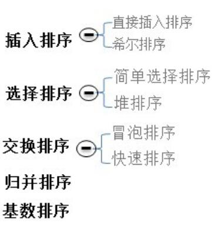
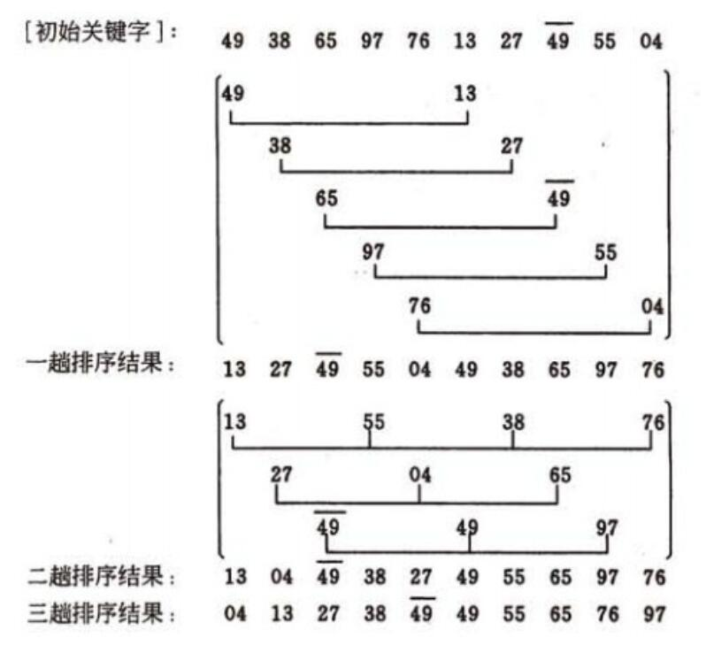

# 参考资料

[八大排序算法](http://blog.csdn.net/hguisu/article/details/7776068)
[常用排序算法总结](http://www.cnblogs.com/eniac12/p/5329396.html#s3)
[2017互联网求职面试知识复习](https://github.com/it-interview/easy-job)

# 排序算法

|插入排序|选择排序|交换排序|||
|-|-|-|-|-|-|
|直接插入排序<br>希尔排序|简单选择排序<br>堆排序|冒泡排序<br>快速排序|归并排序|基数排序|桶排序|

|排序算法|是否稳定|平均|最好|最坏|空间复杂度|
|-|-|-|-|-|-|
|插入排序|稳定|n^2|n|n^2|
|希尔排序|不稳定|n^1.3|n|n^s 1<s<2|
|选择排序|不稳定|n^2|n^2|n^2|
|堆排序|不稳定|nlogn|nlogn|nlogn|
|冒泡排序|稳定|n^2|n|n^2|
|快速排序|不稳定|nlogn|nlogn|n^2|
|归并排序|稳定|nlogn|nlogn|nlogn|
|基数排序|稳定|d(n+r)|d(n+r)|d(n+r)|


## 插入排序 **稳定**

原理：从有序序列中选择合适的位置进行插入

复杂度：最好 - 最坏 - 平均 O(n) - O(n^2) - O(n^2)

```java
public void insertiontionSort(int[] a) {
	if (null ==a || a.length < 2) {
		return;
	}
	for (int i = 1; i < a.length; i++) {
		int temp = a[i]; // 暂存
		int j = i - 1;
		while (j >= 0 && temp < a[j]) {
			a[j+1] = a[j];
			j--;
		}
		a[j+1] = temp;
	}
}
```

## 希尔排序(缩小增量排序) **不稳定**

按步长进行分组，组内直接插入，缩小增量再次进行此步骤，增量为1时相当于一次直接插入。

复杂度：最好O(n) - 最坏O(n^s 1<s<2) - 平均O(n^1.3)

```java
public void shellSort(int[] a) {
	if (null == a || a.length < 2) {
		return;
	}
	for (int d = a.length/2; d > 0; d/=2) {
		for (int i = d; i < a.length; i++) {
		// 内部直接插入
			int temp = a[i];
			int j = i - d;
			while (j >= 0 && temp < a[j]) {
				a[j+d] = a[j];
				j -= d;
			}
			a[j+d] = temp;
		}
	}
}
```


## 选择排序 **不稳定**

原理：每次从无序序列选择一个最小的

复杂度：最好O(n^2) - 最坏O(n^2) - 平均O(n^2)

```java
public void selectSort(int[] a) {
	if (null == a || a.length < 2) {
		return;
	}

	for (int i = 0; i < a.length; i++) {
		int k = i;
		for (int j = i + 1; j < a.length; j++) {
			if (a[j] < a[k]) {
				k = j;
			}
		}
		if (k != i) {
			int temp = a[k];
			a[k] = a[i];
			a[i] = temp;
		}
	}
}

```


## 堆排序

原理：利用堆的特性

复杂度：O(nlogn) [平均 - 最好 - 最坏]

```java
// 堆排序
public void heapSort(int[] a) {
	if (null == a || a.length < 2) {
		return;
	}
	buildMaxHeap(a);

	for (int i = a.length - 1; i >= 0; i--) {
		int temp = a[0];
		a[0] = a[i];
		a[i] = temp;
		adjustHeap(a, i, 0);
	}
}

// 建堆
private void buildMaxHeap(int[] a) {
	for (int i = a.length/2; i >= 0; i--) {
		adjustHeap(a, a.length, i);
	}
}

// 调整堆
private void adjustHeap(int[] a, int size, int parent) {
	int left = 2 * parent + 1;
	int right = 2 * parent + 2;
	int largest = parent;

	if (left < size && a[left] > a[largest]) {
		largest = left;
	}

	if (right < size && a[right] > a[largest]) {
		largest = right;
	}

	if (parent != largest) {
		int temp = a[parent];
		a[parent] = a[largest];
		a[largest] = temp;
		adjustHeap(a, size, largest);
	}
}
```

## 冒泡排序 **稳定**

原理：相邻两个元素比较大小进行交换，一趟冒泡后会有一个元素到达最终位置

复杂度：最好 - 最坏 - 平均 O(n) - O(n^2) - O(n^2)

```java
public void bubbleSort(int[] a) {
	if (null == a || a.length < 2) {
		return;
	}
	boolean flag;
	for (int i = 0; i < a.length - 1; i++) {
		flag = false;
		for (int j = 0; j < a.length - 1 - i; j++) {
			if (a[j] > a[j+1]) {
				int temp = a[j];
				a[j] = a[j+1];
				a[j+1] = temp;
				flag = true;
			}
		}
		if (flag == false) {
			return;
		}
	}
}
```


## 快速排序 **不稳定**

原理：分治+递归

复杂度：最好O(nlgn) - 最坏O(n^2) - 平均O(nlgn)

```java
public void quickSort(int[] a, int low, int high) {

	if (low < high) {
		int mid = partition(a, low, high);
		quickSort(a, low, mid - 1);
		quickSort(a, mid + 1, high);
	}
}

private int partition(int[] a, int low, int high) {
	int pivot = a[low];

	while (low < high) {
		while (low < high && a[high] >= pivot) {
			high--;
		}
		a[low] = a[high];
		while (low < high && a[low] <= pivot) {
			low++;
		}
		a[high] = a[low];
	}
	a[low] = pivot;

	return low;
}
```
选取pivot的方式：固定基准元 随机基准 三数取中

快排的优化：针对随机数组+有序数组+重复数组

1.当待排序序列的长度分割到一定大小后，使用插入排序<三数取中+插入排序>：效率提高一些，但是都解决不了重复数组的问题。

2.在一次分割结束后，可以把与Key相等的元素聚在一起，继续下次分割时，不用再对与key相等元素分割
<三数取中+插排+聚集相同元素>

## 归并排序 **稳定**

原理：两个有序序列的合并，方法：分治 + 递归

复杂度：最好O(nlgn) - 最坏O(nlgn) - 平均O(nlgn)

```java
public void mergeSort(int[] a, int low, int high) {
	int mid = (low + high) / 2;
	if (low < high) {
		//左边
		mergeSort(a, low, mid);
		//右边
		mergeSort(a, mid + 1, high);
		//有序序列归并
		merge(a, low, mid, high);
	}
}

private void merge(int[] a, int low, int mid, int high) {
	int[] temp = new int[high - low + 1];
	// 左指针
	int i = low;
	// 右指针
	int j = mid + 1;
	// 临时数组指针
	int k = 0;

	while (i <= mid && j <= high) {
		if (a[i] < a[j]) {
			temp[k++] = a[i++];
		} else {
			temp[k++] = a[j++];
		}
	}

	//左边剩余
	while (i <= mid) {
		temp[k++] = a[i++];
	}

	//右边剩余
	while (j <= high) {
		temp[k++] = a[j++];
	}

	// 倒出
	for (int t = 0; t < temp.length; t++) {
		a[t + low] = temp[t];
	}
}

```


## 基数排序 **稳定**

原理：分配加收集

复杂度： O(d(n+r)) r为基数d为位数 空间复杂度O(n+r)

```java
// 基数排序
	public void radixSort(int[] a, int digit) {
		// 基数
		final int radix = 10;
		// 桶中的数据统计
		int[] count = new int[radix];
		int[] bucket = new int[a.length];

		// 按照从低位到高位的顺序执行排序过程
		for (int i = 1; i <= digit; i++) {
			// 清空桶中的数据统计
			for (int j = 0; j < radix; j++) {
				count[j] = 0;
			}

			// 统计各个桶将要装入的数据个数
			for (int j = 0; j <= a.length; j++) {
				int index = getDigit(a[j], i);
				count[index]++;
			}

			// count[i]表示第i个桶的右边界索引
			for (int j = 1; j < radix; j++) {
				count[j] = count[j] + count[j - 1];
			}

			// 将数据依次装入桶中
            // 这里要从右向左扫描，保证排序稳定性
			for (int j = a.length-1; j >= 0; j--) {
				int index = getDigit(a[j], i);
				bucket[count[index] - 1] = a[j];
				count[index]--;
			}

			// 取出，此时已是对应当前位数有序的表
			for (int j = 0; j < bucket.length; j++) {
				a[j] = bucket[j];
			}
		}
	}

	// 获取x的第d位的数字，其中最低位d=1
	private int getDigit(int x, int d) {
		String div = "1";
		while (d >= 2) {
			div += "0";
			d--;
		}
		return x/Integer.parseInt(div) % 10;
	}
}
```


# 排序算法详解

排序有内部排序和外部排序，内部排序是数据记录在内存中进行排序，而外部排序是因排序的数据很大，一次不能容纳全部的排序记录，在排序过程中需要访问外存。我们这里主要讨论内部排序。




## 插入排序

### 简单插入排序

插入排序是一种简单直观的排序算法。它的工作原理非常类似于我们抓扑克牌。对于未排序数据(右手抓到的牌)，在已排序序列(左手已经排好序的手牌)中从后向前扫描，找到相应位置并插入。

插入排序在实现上，通常采用in-place排序（即只需用到O(1)的额外空间的排序），因而在从后向前扫描过程中，需要反复把已排序元素逐步向后挪位，为最新元素提供插入空间。

具体算法描述如下：
1. 从第一个元素开始，该元素可以认为已经被排序
2. 取出下一个元素，在已经排序的元素序列中从后向前扫描
3. 如果该元素（已排序）大于新元素，将该元素移到下一位置
4. 重复步骤3，直到找到已排序的元素小于或者等于新元素的位置
5. 将新元素插入到该位置后
6. 重复步骤2~5


如果碰见一个和插入元素相等的，那么插入元素把想插入的元素放在相等元素的后面。所以，相等元素的前后顺序没有改变，从原无序序列出去的顺序就是排好序后的顺序，所以
>插入排序是**稳定**排序。
时间复杂度**O（n^2)** ,空间复杂度O（1）。
插入排序不适合对于数据量比较大的排序应用。


```java
  /**
	 * 插入排序。时间复杂度O（n^2),空间复杂度O（1），稳定
	 * 升序。
	 * @param a
	 * @return
	 */
	public static int[] insertionSorting(int[] a){
		for(int i=1;i<a.length;i++){
			int n=a[i];
			int j=i-1;
			while(j>=0&&a[j]>n){//升序。改为a[j]<n则为降序
				a[j+1]=a[j];
				j--;
			}
			a[j+1]=n;
		}
		return a;
	}
```
### 二分插入排序

对于插入排序，如果比较操作的代价比交换操作大的话，可以采用二分查找法来减少比较操作的次数，我们称为二分插入排序。
当n较大时，二分插入排序的比较次数比直接插入排序的最差情况好得多，但比直接插入排序的最好情况要差，所当以元素初始序列已经接近升序时，直接插入排序比二分插入排序比较次数少。二分插入排序元素移动次数与直接插入排序相同，依赖于元素初始序列。

最差时间复杂度 ---- O(n^2)
最优时间复杂度 ---- O(nlogn)
平均时间复杂度 ---- O(n^2)
所需辅助空间 ------ O(1)

### 希尔排序

希尔排序，也叫递减增量排序，是插入排序的一种更高效的改进版本。希尔排序是不稳定的排序算法。

希尔排序是基于插入排序的以下两点性质而提出改进方法的：
1. 插入排序在对几乎已经排好序的数据操作时，效率高，即可以达到线性排序的效率
2. 但插入排序一般来说是低效的，因为插入排序每次只能将数据移动一位

希尔排序通过将比较的全部元素分为几个区域来提升插入排序的性能。这样可以让一个元素可以一次性地朝最终位置前进一大步。然后算法再取越来越小的步长进行排序，算法的最后一步就是普通的插入排序，但是到了这步，需排序的数据几乎是已排好的了（此时插入排序较快）。
假设有一个很小的数据在一个已按升序排好序的数组的末端。如果用复杂度为O(n^2)的排序（冒泡排序或直接插入排序），可能会进行n次的比较和交换才能将该数据移至正确位置。而希尔排序会用较大的步长移动数据，所以小数据只需进行少数比较和交换即可到正确位置。

希尔排序是不稳定的排序算法，虽然一次插入排序是稳定的，不会改变相同元素的相对顺序，但在不同的插入排序过程中，相同的元素可能在各自的插入排序中移动，最后其稳定性就会被打乱。



```java
/**
 * 希尔排序
 * 最优复杂度O(n),平均复杂度跟步长选取有关
 * 不稳定
 * @param a
 * @return
 */
public static int[] shellShorting(int[] a){
	int n=a.length;
	int h = 0;
		while (h <= n)                          // 生成初始增量
		{
				h = 3 * h + 1;
		}
		while (h >= 1)
		{
				for (int i = h; i < n; i++)
				{
						int j = i - h;
						int get = a[i];
						while (j >= 0 && a[j] > get)
						{
								a[j + h] = a[j];
								j = j - h;
						}
						a[j + h] = get;
				}
				h = (h - 1) / 3;                    // 递减增量
		}
		return a;
}

```

## 选择排序

### 简单选择排序

选择排序也是一种简单直观的排序算法。它的工作原理很容易理解：初始时在序列中找到最小（大）元素，放到序列的起始位置作为已排序序列；然后，再从剩余未排序元素中继续寻找最小（大）元素，放到已排序序列的末尾。以此类推，直到所有元素均排序完毕。

注意选择排序与冒泡排序的区别：冒泡排序通过依次交换相邻两个顺序不合法的元素位置，从而将当前最小（大）元素放到合适的位置；而选择排序每遍历一次都记住了当前最小（大）元素的位置，最后仅需一次交换操作即可将其放到合适的位置。

选择排序的代码如下：
